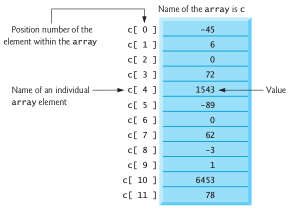
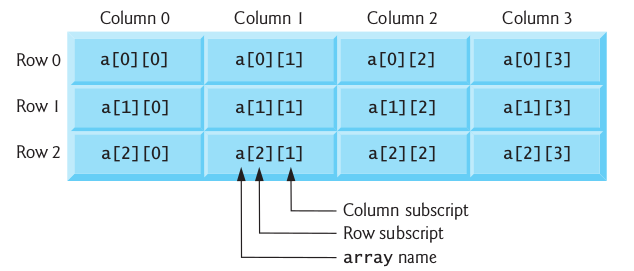

# Arrays & Vectors

Two new data structures - collections of related data items.
- **arrays** which are fixed-size collections consisting of data items of the same type, and
- **vectors** which are collections (also of data items of the same type) that can grow and shrink dynamically at execution time.

Both array and vector are C++ standard library class templates.

## Arrays

An **array** is a **contiguous group** of memory locations that all have the **same type**.

To refer to a particular location or element in the array, *specify* the **name** of the array and the **position number** of the particular element.
- The position number is more formally called a **subscript** or **index** (this number specifies the number of elements from the beginning of the array).
- A subscript must be an integer or integer expression (using any integral type).



- The first element in every array has subscript 0 (zero) and is sometimes called the zeroth element.
- The highest subscript in array c is 11, which is 1 less than the number of elements in the array (12).

### Declaring Arrays

Arrays occupy space in memory.
- arrays can be declared to contain values of most data types.

To specify the type of the elements and the number of elements required by an array use a declaration of the form:

        array< type, arraySize > arrayName;

The notation `<type, arraySize>` indicates that array is a class template.
- The compiler reserves the appropriate amount of memory based on the type of the elements and the arraySize.
- This is C++11 style declaration, and it requires to include `<array>` header file.

```c++
// Initializing an array in a declaration.
#include <iostream>
#include <iomanip>
#include <array>
using namespace std;

int main() {
   array<int, 5> n{32, 27, 64, 18, 95}; // list initializer

   cout << "Element" << setw(10) << "Value" << endl;

   // output each array element's value
   for (size_t i{0}; i < n.size(); ++i) {
      cout << setw(7) << i << setw(10) << n[i] << endl;
   }
}
```

The elements of an array also can be initialized in the array declaration by following the array name with an equals sign and a brace-delimited comma-separated list of **initializers**.
- If there are **fewer** initializers than elements in the array, the remaining array elements are initialized to zero.

There is also old *C-style* array declaration:

        type arrayName[arraySize];

The following examples demonstrate how to declare arrays, how to initialize arrays and how to perform common array manipulations.

```c++
// Initializing an array ’s elements to zeros and printing the array .
#include <iostream>
#include <iomanip>
using namespace std;

int main() {
   int n[5]; // n is an array of 5 int values

   // initialize elements of array n to 0
   for (int i{0}; i < 5; ++i) {
      n[i] = 0; // set element at location i to 0
   }

   cout << "Element" << setw(10) << "Value" << endl;

   // output each array element's value
   for (int j{0}; j < 5; ++j) {
      cout << setw(7) << j << setw(10) << n[j] << endl;
   }
}
```

A constant variable can be used to specify array's size.
- Use `const` modifier.
- It must be initialized with a constant expression when it's declared and cannot be modified thereafter.
- Constant variables are also called named constants or read-only variables.
- Not initializing a constant variable when it’s declared is a compilation error.
- Assigning a value to a constant variable in a separate statement from its declaration is a compilation error.

```c++
// Set array s to the even integers from 2 to 10.
#include <iostream>
#include <iomanip>
#include <array>
using namespace std;

int main() {
   // constant variable can be used to specify array size
   const size_t arraySize{5}; // must initialize in declaration

   array<int, arraySize> values; // array values has 5 elements

   for (size_t i{0}; i < values.size(); ++i) { // set the values
      values[i] = 2 + 2 * i;
   }

   cout << "Element" << setw(10) << "Value" << endl;

   // output contents of array s in tabular format
   for (size_t j{0}; j < values.size(); ++j) {
      cout << setw(7) << j << setw(10) << values[j] << endl;
   }
}
```

Often, the elements of an array represent a series of values to be used in a calculation.

```c++
// Compute the sum of the elements of an array.
#include <iostream>
#include <array>
using namespace std;

int main() {
   const size_t arraySize{4}; // specifies size of array
   array<int, arraySize> a{10, 20, 30, 40};
   int total{0};

   // sum contents of array a
   for (size_t i{0}; i < a.size(); ++i) {
      total += a[i];
   }

   cout << "Total of array elements: " << total << endl;
}
```

Use array to draw a histogram:

```c++
#include <iostream>
#include <iomanip>
#include <array>
using namespace std;

int main() {
   const size_t arraySize{11};
   array<unsigned int, arraySize> n{0, 0, 0, 0, 0, 0, 1, 2, 4, 2, 1};

   cout << "Grade distribution:" << endl;

   // for each element of array n, output a bar of the chart
   for (size_t i{0}; i < n.size(); ++i) {
      // output bar labels ("0-9:", ..., "90-99:", "100:")
      if (0 == i) {
         cout << "  0-9: ";
      }
      else if (10 == i) {
         cout << "  100: ";
      }
      else {
         cout << i * 10 << "-" << (i * 10) + 9 << ": ";
      }

      // print bar of asterisks
      for (unsigned int stars{0}; stars < n[i]; ++stars) {
         cout << '*';
      }

      cout << endl; // start a new line of output
   }
}
```

### Static Arrays

A program initializes **static local arrays** when their declarations are first encountered.
 - If a static array is not initialized explicitly by you, each element of that array is initialized to zero by the compiler when the array is created.
- We can apply `static` to a local array declaration so that it's not created and initialized each time the program calls the function and is not destroyed each time the function terminates. This can improve performance, especially when using large arrays.

### Ranges-based iteration

The C++ 11 **range-based** for statement allows you to process all the elements of an array **without using** a counter, thus avoiding the possibility of 'stepping outside' the array and eliminating the need for you to implement your own bounds checking.
- When processing all elements of an array, if you don’t need access to an array element’s subscript, use the range-based for statement.

```c++
// Using range-based for to multiply an array's elements by 2.
#include <iostream>
#include <array>
using namespace std;

int main() {
   array<int, 5> items{1, 2, 3, 4, 5};

   // display items before modification
   cout << "items before modification: ";
   for (int item : items) {
      cout << item << " ";
   }

   // multiply the elements of items by 2
   for (int& itemRef : items) {
      itemRef *= 2;
   }

   // display items after modification
   cout << "\nitems after modification: ";
   for (int item : items) {
      cout << item << " ";
   }

   cout << endl;
}
```

### Lab 1

Case study on developing a GradeBook class that instructors can use to maintain students' grades on an exam and display a grade report that includes the grades, class average, lowest grade, highest grade and a grade distribution bar chart.
- Stored the grades for one exam in a one-dimensional array.

```c++
#include <iostream>
#include <array>
using namespace std;

int main() {
    array<int, 10> grades{87, 68, 94, 100, 83, 78, 85, 91, 76, 87};

    // output each student's grade
    for (size_t student{0}; student < grades.size(); ++student) {
        cout << "Student " << std::setw(2) << student + 1 << ": "
        << std::setw(3) << grades[student] << std::endl;
    }

    int total{0}; // initialize total
    // sum grades in array
    for (int grade : grades) {
        total += grade;
    }
    cout << "\nClass average is " << static_cast<double>(total) / grades.size();
}
```

### Sorting and Searching Arrays

**Sorting** data - placing it into ascending or descending order - is one of the most important computing applications.

**Searching:** Often it may be necessary to determine whether an array contains a value that matches a certain key value.

Use the built-in C++ Standard Library:
- **sort** function to arrange the elements in an array into ascending order,
- **binary_search** function to determine whether a value is in the array.
- include header `<algorithm>`

```c++
// Sorting and searching arrays.
#include <iostream>
#include <iomanip>
#include <array>
#include <string>
#include <algorithm> // contains sort and binary_search
using namespace std;

int main() {
   const size_t arraySize{7}; // size of array colors
   array<string, arraySize> colors{"red", "orange", "yellow",
      "green", "blue", "indigo", "violet"};

   // output original array
   cout << "Unsorted array:\n";
   for (string color : colors) {
      cout << color << " ";
   }

   sort(colors.begin(), colors.end()); // sort contents of colors

   // output sorted array
   cout << "\nSorted array:\n";
   for (string item : colors) {
      cout << item << " ";
   }

   // search for "indigo" in colors
   bool found{binary_search(colors.begin(), colors.end(), "indigo")};
   cout << "\n\n\"indigo\" " << (found ? "was" : "was not")
      << " found in colors" << endl;

   // search for "cyan" in colors
   found = binary_search(colors.begin(), colors.end(), "cyan");
   cout << "\"cyan\" " << (found ? "was" : "was not")
      << " found in colors" << endl;
}
```

### Multidimensional Arrays

You can use arrays with **two dimensions** (i.e., subscripts) to represent tables of values consisting of information arranged in rows and columns.
- To identify a particular table element, specify two subscripts - by convention, the first identifies the element's **row** and the second identifies the element's **column**.
- Arrays with two or more dimensions are known as **multidimensional arrays**.
- In general, an array with m rows and n columns is called an **m-by-n array**.



*Note: Referencing a two-dimensional array element `a[x][y]` as `a[x,y]` is an error.*

```c++
// Initializing multidimensional arrays.
#include <iostream>
#include <array>
using namespace std;

const size_t rows{2};
const size_t columns{3};
void printArray(const array<array<int, columns>, rows>&);

int main() {
   array<array<int, columns>, rows> array1{1, 2, 3, 4, 5, 6};
   array<array<int, columns>, rows> array2{1, 2, 3, 4, 5};

   cout << "Values in array1 by row are:" << endl;
   printArray(array1);

   cout << "\nValues in array2 by row are:" << endl;
   printArray(array2);
}

// output array with two rows and three columns
void printArray(const array<array<int, columns>, rows>& a) {
   // loop through array's rows
   for (auto const& row : a) {
      // loop through columns of current row
      for (auto const& element : row) {
         cout << element << ' ';
      }

      cout << endl; // start new line of output
   }
}
```

### Nested Range-Based for Statements

To process the elements of a two-dimensional array, we use a nested loop in which the outer loop iterates through the rows and the inner loop iterates through the columns of a given row.
- The C++11 auto keyword tells the compiler to infer (determine) a variable’s data type based on the variable’s initializer value.

```c++
total = 0;
for (auto row : a) { // for each row
    for (auto column : row) { // for each column in row
        total += column;
    }
}
```

- We could have implemented the nested loop with counter-controlled iteration as follows:

```c++
for (size_t row{0}; row < a.size(); ++row) {
    for (size_t column{0}; column < a[row].size(); ++column) {
        cout << a[row][column] << ' ';
    }
    cout << endl;
}
```

## Vectors

C++ Standard Library class template vector is similar to class template array, but also supports dynamic resizing.
- Standard class template vector is defined in header `<vector>` and belongs to namespace `std`.
- By default, all the elements of a vector object are set to 0.
- `vectors` can be defined to store most data types.
- vector member function `size` obtain the number of elements in the vector.
- As with class template array, you can also do this using a counter-controlled loop and the subscript ([]) operator.
- Parentheses used, rather than braces, to pass the size argument to each vector object's constructor.
- When creating a vector, if the braces contain one value of the vector's element type, the braces are treated as a one-element initializer list, rather than a call to the constructor that sets the vector's size.
- The following declaration actually creates a one-element `vector<int>` containing the int value 7, not a 7-element vector


        vector<int> integers1{7};

- You can use the assignment (=) operator with vector objects.
- As is the case with arrays, C++ is not required to perform bounds checking when vector elements are accessed with square brackets.
- Standard class template vector provides bounds checking in its member function at (as does class template array).

One of the key differences between a vector and an array is that a vector can dynamically grow and shrink as the number of elements it needs to accommodate varies.
- Use the vector's `push_back` member function to add a new element.

```c++
// Demonstrating C++ Standard Library class template vector.
#include <iostream>
#include <iomanip>
#include <vector>
#include <stdexcept>
using namespace std;

void outputVector(const vector<int>&); // display the vector
void inputVector(vector<int>&); // input values into the vector

int main() {
   vector<int> integers1(7); // 7-element vector<int>
   vector<int> integers2(10); // 10-element vector<int>

   // print integers1 size and contents
   cout << "Size of vector integers1 is " << integers1.size()
      << "\nvector after initialization: ";
   outputVector(integers1);

   // print integers2 size and contents
   cout << "\nSize of vector integers2 is " << integers2.size()
      << "\nvector after initialization: ";
   outputVector(integers2);

   // input and print integers1 and integers2
   cout << "\nEnter 17 integers:" << endl;
   inputVector(integers1);
   inputVector(integers2);

   cout << "\nAfter input, the vectors contain:\n"
      << "integers1: ";
   outputVector(integers1);
   cout << "integers2: ";
   outputVector(integers2);

   // use inequality (!=) operator with vector objects
   cout << "\nEvaluating: integers1 != integers2" << endl;

   if (integers1 != integers2) {
      cout << "integers1 and integers2 are not equal" << endl;
   }

   // create vector integers3 using integers1 as an
   // initializer; print size and contents
   vector<int> integers3{integers1}; // copy constructor

   cout << "\nSize of vector integers3 is " << integers3.size()
      << "\nvector after initialization: ";
   outputVector(integers3);

   // use overloaded assignment (=) operator
   cout << "\nAssigning integers2 to integers1:" << endl;
   integers1 = integers2; // assign integers2 to integers1

   cout << "integers1: ";
   outputVector(integers1);
   cout << "integers2: ";
   outputVector(integers2);

   // use equality (==) operator with vector objects
   cout << "\nEvaluating: integers1 == integers2" << endl;

   if (integers1 == integers2) {
      cout << "integers1 and integers2 are equal" << endl;
   }

   // use square brackets to use the value at location 5 as an rvalue
   cout << "\nintegers1[5] is " << integers1[5];

   // use square brackets to create lvalue
   cout << "\n\nAssigning 1000 to integers1[5]" << endl;
   integers1[5] = 1000;
   cout << "integers1: ";
   outputVector(integers1);

   // attempt to use out-of-range subscript
   try {
      cout << "\nAttempt to display integers1.at(15)" << endl;
      cout << integers1.at(15) << endl; // ERROR: out of range
   }
   catch (out_of_range& ex) {
      cerr << "An exception occurred: " << ex.what() << endl;
   }

   // changing the size of a vector
   cout << "\nCurrent integers3 size is: " << integers3.size() << endl;
   integers3.push_back(1000); // add 1000 to the end of the vector
   cout << "New integers3 size is: " << integers3.size() << endl;
   cout << "integers3 now contains: ";
   outputVector(integers3);
}

// output vector contents
void outputVector(const vector<int>& items) {
   for (int item : items) {
      cout << item << " ";
   }

   cout << endl;
}

// input vector contents
void inputVector(vector<int>& items) {
   for (int& item : items) {
      cin >> item;
   }
}
```
### Lab 2

Use a one-dimensional array to solve the following problem. Read in 20 numbers, each of which is between 10 and 100, inclusive. As each number is read, validate it and store it in the array only if it isn't a duplicate of a number already read. After reading all the values, display only the unique values that the user entered. Provide for the "worst case" in which all 20 numbers are different. Use the smallest possible array to solve this problem.
