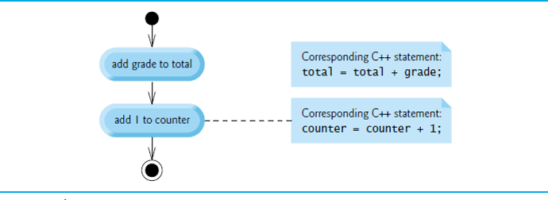
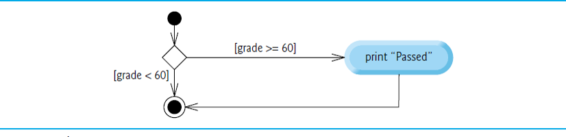
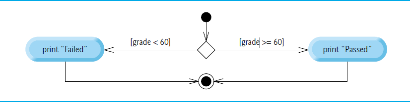
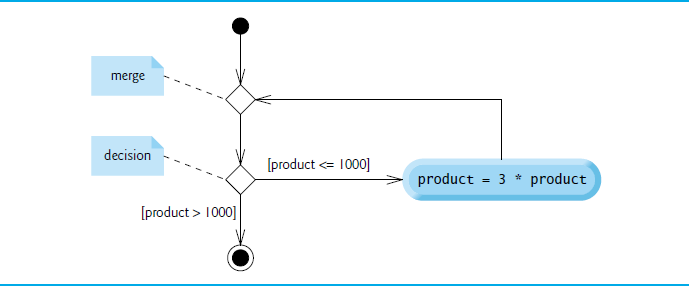

# Control Statements

## Algorithms

- Any solvable computing problem can be solved by the execution a series of actions in a specific order.
- An **algorithm** is a **procedure** for solving a problem in terms of
  - the **actions** to execute and
  - the **order** in which these actions execute
- Specifying the order in which statements (actions) execute in a computer program is called **program control**.

## Pseudocode

- Pseudocode is an artificial and informal language that helps you develop algorithms.
- Similar to everyday English
- Convenient and user friendly.
- Helps you "think out" a program before attempting to write it.
- Carefully prepared pseudocode can easily be converted to structured portions of C++ programs.
- Normally describes only executable statements.
- Declarations (that do not have initializers or do not involve constructor calls) are not executable statements.

## Pseudocode (cont.)

**Example:** the algorithm that inputs two integers from the user, adds these integers and displays their sum.
```
Prompt the user to enter the first integer
Input the first integer

Prompt the user to enter the second integer
Input the second integer

Add first and second integers, store result
Display result
```

## Control Structures

- Normally, statements in a program are executed one after the other in the order in which they’re written.
  - Called **sequential execution**.
- Various C++ statements enable you to specify that the next statement to execute may be other than the next one in sequence.
- Called **transfer of control**.
- All programs could be written in terms of only three **control structures**:
  - the **sequence structure**
  - the **selection structure**
  - the **iteration structure**


## Sequence Structure



*Note: The Unified Modeling Language (UML) activity diagram of  illustrates a typical sequence structure in which two calculations are performed in order*

- An activity diagram models the **workflow** (also called the **activity**) of a portion of a software system.

## Activity Diagrams

- Activity diagrams help you develop and represent algorithms, but many programmers prefer pseudocode.
- Activity diagrams clearly show how control structures operate.
- Activity diagrams are composed of special-purpose symbols, such as **action state symbols** (rectangles with their left and right sides replaced with arcs curving outward), **diamonds** and **small circles**; these symbols are connected by **transition arrows**, which represent the flow of the activity.

## Activity Diagrams (cont.)

- The **solid circle** at the top of the diagram represents the activity's **initial state** - the beginning of the workflow before the program performs the modeled activities.
- The **solid circle surrounded by a hollow circle** that appears at the bottom of the activity diagram represents the **final state** - the end of the workflow after the program performs its activities.
- **Action states** represent actions to perform.
  - Each contains an **action expression** that specifies a particular action to perform.
- The arrows in the activity diagram are called transition arrows.
  - Represent **transitions**, which indicate the order in which the actions represented by the action states occur.
- Rectangles with the upper-right corners folded over are called **notes** in the UML.
  - Explanatory remarks that describe the purpose of symbols in the diagram.
- A **dotted line** connects each note with the element that the note describes.

## Selection Statements

C++ has three types of selection statements:
- The **if** selection statement either performs (selects) an action (or group of actions) if a condition (predicate) is true or skips the action (or group of actions) if the condition is false.
- The **if...else** selection statement performs an action (or group of actions) if a condition is true or performs a different action (or group of actions) if the condition is false.
- The **switch** selection statement performs one of many different actions (or groups of actions), depending on the value of an integer expression.


## Selection Statements (cont.)

C++ has three types of selection statements:
- The **if** selection statement is a **single-selection statement** because it selects or ignores a single action (or group of actions).
- The **if...else** statement is called a **double-selection statement** because it selects between two different actions (or groups of actions).
- The **switch** selection statement is called a **multiple-selection statement** because it selects among many different actions (or groups of actions).


## Blocks

- The *if* statement normally expects only one statement in its body.
- To include several statements in an *if* (or the body of an else for an *if...else* statement), enclose the statements in braces.
- Good practice to always use the braces.
- Statements contained in a pair of braces form a **block**.
- A block can be placed anywhere in a function that a single statement can be placed.
- Just as a block can be placed anywhere a single statement can be placed, it’s also possible to have no statement at all—called a **null statement** (or an **empty statement**).
- The null statement is represented by placing a semicolon (;) where a statement would normally be.

## If Single-Selection Statement

Problem:

- Determine whether student’s grade is greater than or equal to 60 and inform student about passing a course.

Pseudocode:

```
If student’s grade is greater than or equal to 60
  Print "Passed"
```

- If true, "Passed" is printed and the next pseudocode statement in order is "performed".
- If false, the print statement is ignored and the next pseudocode statement in order is performed.
- The indentation of the second line is optional, but it’s recommended because it emphasizes the inherent structure of structured programs.

## If Single-Selection Statement

Diagram:



The *diamond* or **decision symbol** indicates that a decision is to be made.
- The workflow will continue along a path determined by the symbol's associated guard conditions, which can be true or false.
- Each transition arrow emerging from a decision symbol has a guard condition in **square brackets** above or next to the arrow.
- If a **guard condition** is true, the workflow enters the action state to which that transition arrow points.

## Program


```c++
#include <iostream>

int studentGrade = 80;

if (studentGrade >= 60) {
    std::cout << "Passed";
}
```

    Passed

## if...else Double-Selection Statement

Specifies an action (or group of actions) to perform when the condition is true and a different action to perform when the condition is false.

Problem:

- Print “Passed” if the student's grade is greater than or equal to 60, or “Failed” otherwise.

Pseudocode:

```
If student’s grade is greater than or equal to 60
  Print "Passed"
Else
  Print "Failed"
```

## Diagram



## Program


```c++
if (studentGrade >= 60) {
    std::cout << "Passed";
}
else {
    std::cout << "Failed";  
}
```

    Passed

## Nested if...else Statements

**Nested if...else statements** test for multiple cases by placing if...else selection statements inside other if...else selection statements.

Problem:

- Print symbol grade based on the student's numerical grade.

## Pseudocode:

```
If student’s grade is greater than or equal to 90
  Print "A"
Else
  If student’s grade is greater than or equal to 80
    Print "B"
  Else
    If student’s grade is greater than or equal to 70
      Print "C"
    Else
      If student’s grade is greater than or equal to 60
        Print "D"
      Else
        Print "F"
```

## Program


```c++
if (studentGrade >= 90) {
    std::cout << "A";
}
else if (studentGrade >= 80) {
    std::cout << "B";
}
else if (studentGrade >= 70) {
    std::cout << "C";
}
else if (studentGrade >= 60) {
    std::cout << "D";
}
else {
    std::cout << "F";  
}
```

    B

## Iteration Statements

C++ provides three types of iteration statements (also called **looping statements** or **loops**) for performing statements repeatedly while a condition (called the **loop-continuation condition**) remains true - **while**, **do...while** and **for**.
- The **while** and **for** statements perform the action (or group of actions) in their bodies zero or more times.
- The **do...while** statement performs the action (or group of actions) in its body **at least once**.


## while Iteration Statement

An iteration statement (also called a **looping statement** or a **loop**) allows you to specify that a program should repeat an action while some condition remains true.

### Example

    While there are more items on my shopping list
        Purchase next item and cross it off my list

“There are more items on my shopping list” is true or false.
- If true, “Purchase next item and cross it off my list” is performed.
    - Performed repeatedly while the condition remains true.
- The statement contained in the While iteration statement constitutes the body of the While
- Eventually, the condition will become false, the iteration will terminate, and the first pseudocode statement after the iteration statement will execute.

### Example 

Consider a program segment that finds the first power of 3 larger than 100. When the following while iteration statement finishes executing, product contains the result.

Program:


```c++
int product = 3;

while (product <= 100) {
    product = 3 * product;
}
std::cout << product << " = 3^5";
```

    243 = 3^5

Diagram:



*Note:*
- Introduces the UML's **merge symbol**, which joins two flows of activity into one flow of activity.
- The UML represents both the merge symbol and the decision symbol as diamonds.
- The merge symbol joins the transitions from the initial state and from the action state, so they both flow into the decision that determines whether the loop should begin (or continue) executing.
- The decision and merge symbols can be distinguished by the number of "incoming" and "outgoing" transition arrows.
- A decision symbol has one transition arrow pointing to the diamond and two or more transition arrows pointing out from the diamond to indicate possible transitions from that point.
    - Each transition arrow has a guard condition next to it.
- A merge symbol has two or more transition arrows pointing to the diamond and only one transition arrow pointing from the diamond, to indicate multiple activity flows merging to continue the activity.
- Unlike the decision symbol, the merge symbol does not have a counterpart in C++ code.

### Warning

Not providing in the body of a **while** statement an action that eventually causes the condition in the while to become false results in a logic error called an **infinite loop** (the loop never terminates).

## Algorithm with Counter-Controlled Iteration

- This technique uses a variable called a **counter** (or **control variable**) to control the number of times a group of statements will execute.
- Often called **definite iteration** because the number of iterations is known before the loop begins executing.

### Problem

A class of ten students took a quiz. The grades (integers in the range 0-100) for this quiz are available to you. Determine the class average on the quiz.
- The class average is equal to the sum of the grades divided by the number of students.
- The algorithm for solving this problem on a computer must input each grade, keep track of the total of all grades entered, perform the averaging calculation and print the result.


Pseudocode:

    Set total to zero
    Set grade counter to one
    
    While grade counter is less than or equal to ten
        Prompt the user to enter the next grade
        Input the next grade
        Add the grade into the total
        Add one to the grade counter
    
    Set the class average to the total divided by ten
    Print the class average
    
Program:


```c++
// Solving the class-average problem using counter-controlled iteration.
#include <iostream>
using namespace std;

int main() {
    // initialization phase
    int total{0}; // initialize sum of grades entered by the user
    unsigned int gradeCounter{1}; // initialize grade # to be entered next

    // processing phase uses counter-controlled iteration
    while ( gradeCounter <= 10 ) { // loop 10 times
        cout << "Enter grade: "; // prompt
        int grade;
        cin >> grade; // input next grade
        total = total + grade; // add grade to total
        gradeCounter = gradeCounter + 1; // increment counter by 1
    }
    
    // termination phase
    int average = total / 10; // int division yields int result
    
    // display total and average of grades
    cout << "\nTotal of all 10 grades is " << total;
    cout << "\nClass average is " << average << endl;
}
```
