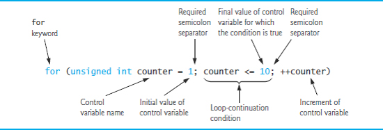
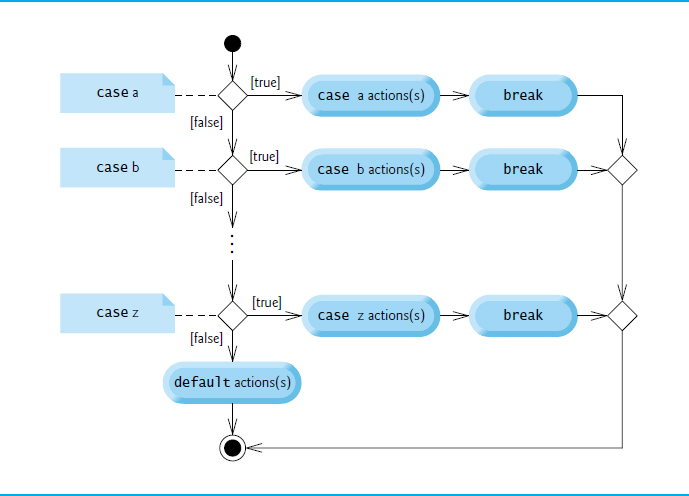

# Control Statements

## Algorithms

- Any solvable computing problem can be solved by the execution a series of actions in a specific order.
- An **algorithm** is a **procedure** for solving a problem in terms of
  - the **actions** to execute and
  - the **order** in which these actions execute
- Specifying the order in which statements (actions) execute in a computer program is called **program control**.

## Pseudocode

- Pseudocode is an artificial and informal language that helps you develop algorithms.
- Similar to everyday English
- Convenient and user friendly.
- Helps you "think out" a program before attempting to write it.
- Carefully prepared pseudocode can easily be converted to structured portions of C++ programs.
- Normally describes only executable statements.
- Declarations (that do not have initializers or do not involve constructor calls) are not executable statements.

**Example:** the algorithm that inputs two integers from the user, adds these integers and displays their sum.
```
Prompt the user to enter the first integer
Input the first integer

Prompt the user to enter the second integer
Input the second integer

Add first and second integers, store result
Display result
```

## Control Structures

- Normally, statements in a program are executed one after the other in the order in which they’re written.
  - Called **sequential execution**.
- Various C++ statements enable you to specify that the next statement to execute may be other than the next one in sequence.
- Called **transfer of control**.
- All programs could be written in terms of only three **control structures**:
  - the **sequence structure**
  - the **selection structure**
  - the **iteration structure**


## Sequence Structure


*Note: The Unified Modeling Language (UML) activity diagram of  illustrates a typical sequence structure in which two calculations are performed in order*

- An activity diagram models the **workflow** (also called the **activity**) of a portion of a software system.
- Activity diagrams are composed of special-purpose symbols, such as **action state symbols** (rectangles with their left and right sides replaced with arcs curving outward), **diamonds** and **small circles**; these symbols are connected by **transition arrows**, which represent the flow of the activity.
- Activity diagrams help you develop and represent algorithms, but many programmers prefer pseudocode.
- Activity diagrams clearly show how control structures operate.
- **Action states** represent actions to perform.
  - Each contains an **action expression** that specifies a particular action to perform.
- The arrows in the activity diagram are called transition arrows.
  - Represent **transitions**, which indicate the order in which the actions represented by the action states occur.
- The **solid circle** at the top of the diagram represents the activity's **initial state** - the beginning of the workflow before the program performs the modeled activities.
- The **solid circle surrounded by a hollow circle** that appears at the bottom of the activity diagram represents the **final state** - the end of the workflow after the program performs its activities.
- Rectangles with the upper-right corners folded over are called **notes** in the UML.
  - Explanatory remarks that describe the purpose of symbols in the diagram.
- A **dotted line** connects each note with the element that the note describes.

## Selection Statements

C++ has three types of selection statements:
- The **if** selection statement either performs (selects) an action (or group of actions) if a condition (predicate) is true or skips the action (or group of actions) if the condition is false.
- The **if...else** selection statement performs an action (or group of actions) if a condition is true or performs a different action (or group of actions) if the condition is false.
- The **switch** selection statement performs one of many different actions (or groups of actions), depending on the value of an integer expression.

C++ has three types of selection statements:
- The **if** selection statement is a **single-selection statement** because it selects or ignores a single action (or group of actions).
- The **if...else** statement is called a **double-selection statement** because it selects between two different actions (or groups of actions).
- The **switch** selection statement is called a **multiple-selection statement** because it selects among many different actions (or groups of actions).


## Iteration Statements

C++ provides three types of iteration statements (also called **looping statements** or **loops**) for performing statements repeatedly while a condition (called the **loop-continuation condition**) remains true - **while**, **do...while** and **for**.
- The **while** and **for** statements perform the action (or group of actions) in their bodies zero or more times.
- The **do...while** statement performs the action (or group of actions) in its body **at least once**.


## Blocks

- The *if* statement normally expects only one statement in its body.
- To include several statements in an *if* (or the body of an else for an *if...else* statement), enclose the statements in braces.
- Good practice to always use the braces.
- Statements contained in a pair of braces form a **block**.
- A block can be placed anywhere in a function that a single statement can be placed.
- Just as a block can be placed anywhere a single statement can be placed, it’s also possible to have no statement at all—called a **null statement** (or an **empty statement**).
- The null statement is represented by placing a semicolon (;) where a statement would normally be.

## If Single-Selection Statement

- Programs use selection statements to choose among alternative courses of action.

Problem:

- Determine whether student’s grade is greater than or equal to 60 and inform student about passing a course.

Pseudocode:

```
If student’s grade is greater than or equal to 60
  Print "Passed"
```

- If true, "Passed" is printed and the next pseudocode statement in order is "performed".
- If false, the print statement is ignored and the next pseudocode statement in order is performed.
- The indentation of the second line is optional, but it’s recommended because it emphasizes the inherent structure of structured programs.

Diagram:


The *diamond* or **decision symbol** indicates that a decision is to be made.
- The workflow will continue along a path determined by the symbol's associated guard conditions, which can be true or false.
- Each transition arrow emerging from a decision symbol has a guard condition in **square brackets** above or next to the arrow.
- If a **guard condition** is true, the workflow enters the action state to which that transition arrow points.

Program:


```c++
#include <iostream>

int studentGrade = 80;

if (studentGrade >= 60) {
    std::cout << "Passed";
}
```

    Passed

## if...else Double-Selection Statement

Specifies an action (or group of actions) to perform when the condition is true and a different action to perform when the condition is false.

Problem:

- Print “Passed” if the student's grade is greater than or equal to 60, or “Failed” otherwise.

Pseudocode:

```
If student’s grade is greater than or equal to 60
  Print "Passed"
Else
  Print "Failed"
```

Diagram:


Program:


```c++
if (studentGrade >= 60) {
    std::cout << "Passed";
}
else {
    std::cout << "Failed";  
}
```

    Passed

## Nested if...else Statements

**Nested if...else statements** test for multiple cases by placing if...else selection statements inside other if...else selection statements.

Problem:

- Print symbol grade based on the student's numerical grade.

Pseudocode:

```
If student’s grade is greater than or equal to 90
  Print "A"
Else
  If student’s grade is greater than or equal to 80
    Print "B"
  Else
    If student’s grade is greater than or equal to 70
      Print "C"
    Else
      If student’s grade is greater than or equal to 60
        Print "D"
      Else
        Print "F"
```

Program:


```c++
if (studentGrade >= 90) {
    std::cout << "A";
}
else if (studentGrade >= 80) {
    std::cout << "B";
}
else if (studentGrade >= 70) {
    std::cout << "C";
}
else if (studentGrade >= 60) {
    std::cout << "D";
}
else {
    std::cout << "F";
}
```

## while Iteration Statement

An iteration statement (also called a **looping statement** or a **loop**) allows you to specify that a program should repeat an action while some condition remains true.

### Example

    While there are more items on my shopping list
        Purchase next item and cross it off my list

“There are more items on my shopping list” is true or false.
- If true, “Purchase next item and cross it off my list” is performed.
    - Performed repeatedly while the condition remains true.
- The statement contained in the While iteration statement constitutes the body of the While
- Eventually, the condition will become false, the iteration will terminate, and the first pseudocode statement after the iteration statement will execute.

### Example

Consider a program segment that finds the first power of 3 larger than 100. When the following while iteration statement finishes executing, product contains the result.

Program:


```c++
int product = 3;

while (product <= 100) {
    product = 3 * product;
}
std::cout << product << " = 3^5";
```

    243 = 3^5

Diagram:


*Note:*
- Introduces the UML's **merge symbol**, which joins two flows of activity into one flow of activity.
- The UML represents both the merge symbol and the decision symbol as diamonds.
- The merge symbol joins the transitions from the initial state and from the action state, so they both flow into the decision that determines whether the loop should begin (or continue) executing.
- The decision and merge symbols can be distinguished by the number of "incoming" and "outgoing" transition arrows.
- A decision symbol has one transition arrow pointing to the diamond and two or more transition arrows pointing out from the diamond to indicate possible transitions from that point.
    - Each transition arrow has a guard condition next to it.
- A merge symbol has two or more transition arrows pointing to the diamond and only one transition arrow pointing from the diamond, to indicate multiple activity flows merging to continue the activity.
- Unlike the decision symbol, the merge symbol does not have a counterpart in C++ code.

### Warning

Not providing in the body of a **while** statement an action that eventually causes the condition in the while to become false results in a logic error called an **infinite loop** (the loop never terminates).

## Algorithm with Counter-Controlled Iteration

- This technique uses a variable called a **counter** (or **control variable**) to control the number of times a group of statements will execute.
- Often called **definite iteration** because the number of iterations is known before the loop begins executing.

### Problem

A class of ten students took a quiz. The grades (integers in the range 0-100) for this quiz are available to you. Determine the class average on the quiz.
- The class average is equal to the sum of the grades divided by the number of students.
- The algorithm for solving this problem on a computer must input each grade, keep track of the total of all grades entered, perform the averaging calculation and print the result.

### Pseudocode

    Set total to zero
    Set grade counter to one

    While grade counter is less than or equal to ten
        Prompt the user to enter the next grade
        Input the next grade
        Add the grade into the total
        Add one to the grade counter

    Set the class average to the total divided by ten
    Print the class average

### Program

```c++
// Solving the class-average problem using counter-controlled iteration.
#include <iostream>
using namespace std;

int main() {
    // initialization phase
    int total{0}; // initialize sum of grades entered by the user
    unsigned int gradeCounter{1}; // initialize grade # to be entered next

    // processing phase uses counter-controlled iteration
    while ( gradeCounter <= 10 ) { // loop 10 times
        cout << "Enter grade: "; // prompt
        int grade;
        cin >> grade; // input next grade
        total = total + grade; // add grade to total
        gradeCounter = gradeCounter + 1; // increment counter by 1
    }

    // termination phase
    int average = total / 10; // int division yields int result

    // display total and average of grades
    cout << "\nTotal of all 10 grades is " << total;
    cout << "\nClass average is " << average << endl;
}
```

Notes:
- A variable declared in a function body is a local variable and can be used only from the line of its declaration to the closing right brace of the block in which the variable is declared.
- A local variable's declaration must appear before the variable is used; otherwise, a compilation error occurs.
- Variable grade - declared in the body of the while loop - can be used only in that block.
- You'll normally initialize counter variables to zero or one, depending on how they are used in an algorithm.

### Lab 1

Write a program that calculates the surface area and volume of cubes with face lengths of 1 to 10 cm. Write an algorithm with a counter-controlled iteration. Use tabs to print the following neatly formatted table of values:

```
Face length   Surface area    Volume
of cube (cm)  of cube (cm^2)  of cube (cm^3)
0             0               0
1             1               1
2             4               8
.             .               .
.             .               .
.             .               .
```

[Lab 1 Solution](../progs/ave-cc.cpp)

## Algorithm with Sentinel-Controlled Iteration

- **Sentinel value** (also called a **signal value**, a **dummy value** or a **flag value**) can be used for "end of data entry."
- Sentinel-controlled iteration is often called **indefinite iteration**
  - the number of iterations is not known in advance.
- Sentinel value must not be an acceptable input value.

### Problem

A class of ten students took a quiz. The grades (integers in the range 0-100) for this quiz are available to you. Determine the class average on the quiz.

### Pseudocode

    Prompt the user to enter the first grade
    Input the first grade (possibly the sentinel)

    While the user has not yet entered the sentinel
      Add this grade into the running total
      Add one to the grade counter
      Prompt the user to enter the next grade
      Input the next grade (possibly the sentinel)

    If the counter is not equal to zero
      Set the average to the total divided by the counter
      Print the average
    else
      Print “No grades were entered”

### Program

```c++
// Solving the class-average problem using sentinel-controlled iteration.
#include <iostream>
#include <iomanip> // parameterized stream manipulators
using namespace std;

int main() {
    // initialization phase
    int total{0}; // initialize sum of grades entered by the user
    unsigned int gradeCounter{0}; // initialize # of grades entered so far

    int grade;
    cout << "Enter grade: "; // prompt
    cin >> grade; // input next grade

    // processing phase uses counter-controlled iteration
    while ( grade != -1 ) { // loop 10 times
        total = total + grade; // add grade to total
        gradeCounter = gradeCounter + 1; // increment counter by 1

        cout << "Enter grade: "; // prompt
        cin >> grade; // input next grade
    }

    // termination phase
    // if user entered at least one grade...
    if ( gradeCounter != 0 ) {
        // use number with decimal point to calculate average of grades
        double average = static_cast<double>(total) / gradeCounter;

        // display total and average (with two digits of precision)
        cout << "\nTotal of the " << gradeCounter
             << " grades entered is " << total;
        cout << setprecision(2) << fixed;
        cout << "\nClass average is " << average << endl;
    }
    else { // no grades were entered, so output appropriate message
        cout << "No grades were entered" << endl;
    }
}
```

## Converting between Fundamental Types

- To perform a floating-point calculation with integers, create **temporary** floating-point values.
- **static_cast operator** accomplishes this task
  - The cast operator **static_cast<double>(total)** creates a **temporary** floating-point copy of its operand in parentheses.
  - Known as explicit conversion
  - The value stored in total is still an integer
- The calculation now consists of a floating-point value divided by the integer *gradeCounter*.
  - The compiler knows how to evaluate only expressions in which the operand types of are identical.
  - Compiler performs **promotion** (also called **implicit conversion**) on selected operands.
  - In an expression containing values of data types int and double, C++ **promotes** int operands to double values.
- Cast operators are available for use with every data type and with class types as well.

### Lab 2

Write an algorithm with a sentinel-controlled iteration that calculates the surface area and volume of a cube with a face length entered by user. Repeat calculations until user enters a negative face length.

[Lab 2 Solution](../progs/ave-sc.cpp)

## Homework 2

Write a program to input N numbers and output
- the sum of all the positive numbers
- the average of all the positive numbers
- the sum of all the non-positive numbers
- the average of all the non-positive numbers
- the sum of all the numbers
- the average of all the numbers
which have been input.

Make as few assumptions as possible about the inputs.

## Algorithm with Counter-Controlled Iteration (cont.)

- Counter-controlled iteration requires
  - a **control variable** (or loop counter)
  - the control variable's **initial value**
  - the control variable's **increment** that's applied during each iteration of the loop
  - the **loop-continuation condition** that determines if looping should continue.

## **For** Iteration Statement

The **for iteration statement** specifies the counter-controlled iteration details in a single line of code.

    for (initialization; condition; increment){
      body
    }

- The initialization occurs once when the loop is encountered.
- The condition is tested next and each time the body completes.
- The body executes if the condition is true.
- The increment occurs after the body executes.
- Then, the condition is tested again.

In most cases, the **for** statement can be represented by an equivalent **while** statement, as follows:

    initialization;
    while (condition){
      body
      increment;
    }

```c++
// Counter-controlled iteration with the for iteration statement.
#include <iostream>
using namespace std;

int main() {
    // for statement header includes initialization,
    // loop-continuation condition and increment
    for (unsigned int counter = 1; counter <= 10; ++counter) {
        cout << counter << " ";
    }
    cout << endl;
}
```



Equivalent program which uses **while** loop statement:

```c++
// Counter-controlled iteration with the for iteration statement.
#include <iostream>
using namespace std;

int main() {
    unsigned int counter = 1; // initialization
    while (counter <= 10) { // loop-continuation condition
        cout << counter << " ";
        ++ counter; // increment
    }
    cout << endl;
}
```

### Lab 3

Write an algorithm from [Lab 1](#lab-1) using counter-controlled loop - `for`.

[Lab 3 Solution](../progs/ave-cc2.cpp)

## **Switch** Multiple-Selection Statement

- The **switch** multiple-selection statement performs many different actions based on the possible values of a variable or expression.

- Each action is associated with the value of an **integral constant expression** (i.e., any combination of character and integer constants that evaluates to a constant integer value).

The syntax for a switch statement in C++ is following

    switch(expression) {
    case constant-expression  :
        statement(s);
        break; //optional
    case constant-expression  :
        statement(s);
        break; //optional
    
    // you can have any number of case statements.
    default : //Optional
        statement(s);
    }

- The switch statement consists of a series of **case labels** and an optional **default case**.
- When the flow of control reaches the `switch`, the program evaluates the **controlling expression** in the parentheses.
- Compares the value of the controlling expression with each case label.
- If a match occurs, the program executes the statements for that `case`.
- The `break` statement causes program control to proceed with the first statement after the `switch`.
- If **no** match occurs between the controlling expression's value and a `case` label, the `default` case executes.
If no match occurs in a `switch` statement that does not contain a `default` case, program control continues with the first statement after the `switch`.




[Run this example](http://tpcg.io/bZM82f)

```c++
#include <iostream>
using namespace std;

int main () {
   // local variable declaration:
   char grade = 'D';

   switch(grade) {
      case 'A' :
         cout << "Excellent!" << endl;
         break;
      case 'B' :
      case 'C' :
         cout << "Well done" << endl;
         break;
      case 'D' :
         cout << "You passed" << endl;
         break;
      case 'F' :
         cout << "Better try again" << endl;
         break;
      default :
         cout << "Invalid grade" << endl;
   }
   cout << "Your grade is " << grade << endl;

   return 0;
}
```

## **Break** and **Continue** Statements

In addition to selection and iteration statements, C++ provides statements:
- `break` - which we discussed in the context of the switch statement,
- and `continue` to alter the flow of control.

The **break** statement, when executed in a `while`, `for`, `do...while` or `switch` statement, causes immediate exit from that statement.
- Program execution continues with the next statement.
- Common uses of the break statement are to escape early from a loop or to skip the remainder of a `switch` statement.

```c++
#include <iostream>
using namespace std;
int main() {
    unsigned int count; // control variable also used after loop
    for (count = 1; count <= 10; count++) { // loop 10 times
        if (count == 5) {
            break; // terminates loop if count is 5
        }
        cout << count << " ";
    }
    cout << "\nBroke out of loop at count = " << count << endl;
}
```
Output:

    1 2 3 4
    Broke out of loop at count = 5

The **continue** statement, when executed in a `while`, `for` or `do...while` statement, skips the remaining statements in the body of that statement and proceeds with the next iteration of the loop.

- In `while` and `do...while` statements, the loop-continuation test evaluates immediately after the continue statement executes.
- In the `for` statement, the increment expression executes, then the loop-continuation test evaluates.

```c++
#include <iostream>
using namespace std;
int main() {
    for (unsigned int count{1}; count <= 10; count++) { // loop 10 times
        if (count == 5) {
            continue; // skip remaining code in loop body if count is 5
        }
        cout << count << " ";
    }
    cout << "\nUsed continue to skip printing 5" << endl;
}
```
Output:

    1 2 3 4 6 7 8 9 10
    Used continue to skip printing 5

## Lab 4

Consider the following problem statement:

- A person invests $1000.00 in a savings account yielding 5% interest. Assuming that all interest is left on deposit in the account, calculate and print the amount of money in the account at the end of each year for 10 years. Use the following formula for determining these amounts:

        a = p*(1+r)^n

where
- `p` is the original amount invested (i.e., the principal),
- `r` is the annual interest rate,
- `n` is the number of years and
- `a` is the amount on deposit at the end of the nth year.

This problem involves a loop that performs the indicated calculation for each of the 10 years the money remains on deposit.

```c++
// Compound-interest calculations
#include <iostream>
#include <iomanip>
#include <cmath> // for pow function

using namespace std;

int main() {
    // set floating-point number format
    cout << fixed << setprecision(2);

    double principal{1000.00}; // initial amount before interest
    double rate{0.05}; // interest rate

    cout << "Initial principal: " << principal << endl;
    cout << "    Interest rate: " << rate << endl;

    // display headers
    cout << "\nYear" << setw(20) << "Amount on deposit" << endl;

    // calculate amount on deposit for each of ten years
    for (unsigned int year{1}; year <= 10; ++year) {
        // calculate amount on deposit at the end of the specified year
        double amount = principal * pow(1.0 + rate, year);
        // display the year and the amount
        cout << setw(4) << year << setw(20) << amount << endl;
    }
}
```

Modify the above program so it will have a function that calculates an amount on deposit given principal rate and year.

**Notes:**

- Stream manipulator `fixed` indicates that floating-point values should be output as fixed-point values with decimal points.

- Stream manipulator `setprecision` specifies the number of digits to the right of the decimal point.

    - Stream manipulators fixed and setprecision remain in effect until they’re changed - such settings are called sticky settings.

- The field width specified with `setw` applies only to the next value output.

[Lab 4 Solution](../progs/compound.cpp)


## Lab 5 - Factorial & *e*

The factorial of a nonnegative integer *n* is written `n!` and is defined as follows for values of *n* greater than 1:

    n! = n * (n-1) * (n-2) * ... * 1

and for *n* = 0 or *n* = 1:

    n! = 1

For example,

    5! = 5 * 4 * 3 * 2 * 1 (which is 120).

Use loop statements in each of the following:

- Write a function that reads a nonnegative integer and computes its factorial.

- Write a program that estimates the value of the mathematical constant *e* by using the formula:

        e = 1 + 1/1! + 1/2! + 1/3! + ...

    - Prompt the user for the desired accuracy of _e_ (i.e., the number of terms in the summation).

[Lab 5 Solution](../progs/e.cpp)
