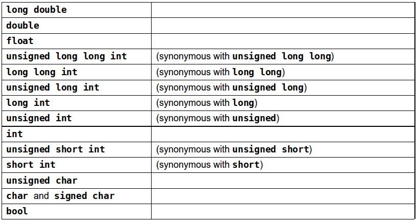

# Functions

Develop and maintain a large program by constructing it from small, simple pieces, or components.

    divide and conquer

Emphasize how to declare and use **functions** to facilitate the design, implementation, operation and maintenance of large programs.

- Function prototypes
- Function overloading
- Function templates
- Recursion

## General

Functions allow you to **modularize** a program by separating its tasks into self-contained units.

- To promote software reusability, every function should be limited to performing a single, well-defined task, and the name of the function should express that task effectively.

A function is invoked by a **function call**, and when the called function completes its task:
- it either **returns a result**,
- or simply **returns control** to the caller.

This hiding of implementation details promotes good software engineering.

## Global Functions

Sometimes functions are not members of a class. They are called **global functions**.

*Example:* The `<cmath>` header provides a collection of functions that enable you to perform common mathematical calculations.
- All functions in the `<cmath>` header are global functions—therefore, each is called simply by specifying the name of the function followed by parentheses containing the function's arguments.

**Problem:** Write program that returns the largest of three inputted integer numbers.

```c++
#include <iostream>
using namespace std;

int maximum(int x, int y, int z); // function prototype

int main()
{
    int a, b, c;
    cout << "Enter three integer numbers: ";
    cin >> a >> b >> c;

    cout << "Maximum number is " << maximum(a,b,c) << endl;
}

int maximum(int x, int y, int z) // function implementation
{
    int maxval = x;

    // determine if y is larger than maximum
    if (maxval < y) {
        maxval = y; // make y new maximum
    }

    // determine if z is larger than maximum
    if (maxval < z) {
        maxval = z; // make z new maximum
    }

    return maxval;
}
```

## Function Prototypes

For a function not defined in a class, you must either **define the function before using it** or you must **declare that the function exists**:
```c++
    int maximum(int x, int y, int z); // function prototype
```
This is a function prototype, which describes the maximum function without revealing its implementation.

A function prototype is a declaration of a function tells the compiler
- the function's name,
- its return type,
- and the types of its parameters.

Above prototype indicates that the function returns an `int`, has the name `maximum` and requires **three** `int` parameters to perform its task.
- The function prototype is the same as the first line of the corresponding function definition, but ends with a required semicolon.

A function prototype is required unless the function is defined before it's used.
- When you use a standard library function like `sqrt`, you do not have access to the function's definition, therefore it cannot be defined in your code before you call the function.
- Instead, you must include its corresponding header (`<cmath>`), which contains the function’s prototype.

**Always provide function prototypes**, even though it’s possible to omit them when functions are defined before they’re used. Providing the prototypes avoids tying the code to the order in which functions are defined (which can easily change as a program evolves).

Important to know:

- Parameter names in function prototypes are optional (they’re ignored by the compiler), but many programmers use these names for documentation purposes.

- Declaring function parameters of the same type as `int x, y` instead of `int x, int y` is a syntax error - a **type** is required for each parameter in the parameter list.

- Compilation errors occur if the function prototype, header and calls do not all agree in the number, type and order of arguments and parameters, and in the return type.

- A function that has many parameters may be performing too many tasks. Consider dividing the function into smaller functions that perform the separate tasks. Limit the function header to one line if possible.

- Multiple parameters are specified in both the function prototype and the function header as a comma-separated list, as are multiple arguments in a function call.

In a function that **does not return** a result (i.e., it has a void return type), we showed that control returns when the program reaches the function-ending right brace.
- You also can explicitly return control to the caller by executing the statement `return;`

## Argument Coercion

An important feature of function prototypes is **argument coercion**:
- forcing arguments to the appropriate types specified by the parameter declarations.
- these conversions occur as specified by C++'s promotion rules.

The promotion rules indicate how to convert between types without losing data.
- The promotion rules apply to expressions containing values of two or more data types.
- The type of each value in a mixed-type expression is promoted to the "highest" type in the expression.
- Converting values to lower fundamental types can result in incorrect values.
    - a value can be converted to a lower fundamental type only by explicitly assigning the value to a variable of lower type or by using a cast operator.

Lists the arithmetic data types in order from "highest type" to "lowest type."


## Random Number Generator

The function **rand** generates an unsigned integer between `0` and `RAND_MAX` (a symbolic constant defined in the `<cstdlib>` header file).

- The function prototype for the **rand** function is in `<cstdlib>`.
- The value of `RAND_MAX` must be at least 32767—the maximum positive value for a two-byte (16-bit) integer.
- For GNU C++, the value of `RAND_MAX` is 2147483647; for Visual Studio, the value of `RAND_MAX` is 32767.
- If **rand** truly produces integers at random, every number between `0` and `RAND_MAX` has an equal chance (or probability) of being chosen each time **rand** is called.

**rand** generates pseudorandom numbers:
- a sequence of numbers that appears to be random.
- sequence repeats itself each time the program executes.

Program can be conditioned to produce a different sequence of random numbers for each execution.
- This is called *randomizing* and is accomplished with the C++ Standard Library function **srand**.
- Takes an unsigned integer argument and seeds **rand** to produce a different sequence of random numbers for each execution.

To randomize without having to enter a seed use
```c++
srand(static_cast<unsigned_int>(time(0)))
```
- Causes the computer to read its clock to obtain the value for the seed.
- Function **time** (with the argument 0 as written in the preceding statement) returns the current time as the number of seconds since January 1, 1970.
- The function prototype for time is in `<ctime>`.

### Lab 1: Craps

1. Simulate a Six-Sided Die

Write a function to produce integers in the range 1 to 6 using the modulus operator (%) with `rand` function.

2. Simulate a Craps Game

Rules of Craps:
- A player rolls two dice. Each die has six faces.
- Faces contain 1, 2, 3, 4, 5 and 6 spots.
- After the dice have come to rest, the sum of the spots on the two upward faces is calculated.
    - If the sum is 7 or 11 on the first roll, the player wins.
    - If the sum is 2, 3 or 12 on the first roll (called "craps"), the player loses (i.e., the "house" wins).
    - If the sum is 4, 5, 6, 8, 9 or 10 on the first roll, then that sum becomes the player’s "point."
- To win, continue rolling until you “make your point.”
- You lose by rolling a 7 before making the point.

### Lab 2: Value of Pi

Estimating the value of Pi using Monte Carlo:

The idea is to simulate random (x, y) points in a 2-D plane with domain as a square of side 1 unit. We then calculate the ratio of number points that lied inside the circle and total number of generated points:

    pi = 4*(circle_points/square_points)

1. Define a function which produces random number in interval [0,1]
2. Use this function to perform evaluation of pi value

## Scope

The portion of the program where an identifier can be used is known as its **scope**.
- block scope
- global namespace scope

Identifiers declared **inside** a block have **block scope**, which begins at the identifier's declaration and ends at the terminating right brace (}) of the enclosing block.
- Local variables have block scope, as do function parameters.
- Any block can contain variable declarations.
- In nested blocks, if an identifier in an outer block has the same name as an identifier in an inner block, the one in the outer block is "hidden" until the inner block terminates.
- The inner block "sees" its own local variable’s value and not that of the enclosing block’s identically named variable.

_Note: Avoid variable names in inner scopes that hide names in outer scopes. Most compilers will warn you about this issue._

An identifier declared **outside** any function or class has **global namespace scope**.
- "known" in all functions from the point at which it’s declared until the end of the file.
- Function definitions, function prototypes placed outside a function, class definitions and global variables all have global namespace scope.
- Global variables are created by placing variable declarations outside any class or function definition. Such variables retain their values throughout a program’s execution.

_Note: Variables used only in a particular function should be declared as local variables in that function rather than as global variables.

```c++
// Scoping example.
#include <iostream>
using namespace std;

void useLocal(); // function prototype
void useStaticLocal(); // function prototype
void useGlobal(); // function prototype

int x{1}; // global variable

int main() {
   cout << "global x in main is " << x << endl;

   int x{5}; // local variable to main

   cout << "local x in main's outer scope is " << x << endl;

   { // block starts a new scope
      int x{7}; // hides both x in outer scope and global x

      cout << "local x in main's inner scope is " << x << endl;
   }

   cout << "local x in main's outer scope is " << x << endl;

   useLocal(); // useLocal has local x
   useStaticLocal(); // useStaticLocal has static local x
   useGlobal(); // useGlobal uses global x
   useLocal(); // useLocal reinitializes its local x
   useStaticLocal(); // static local x retains its prior value
   useGlobal(); // global x also retains its prior value

   cout << "\nlocal x in main is " << x << endl;
}

// useLocal reinitializes local variable x during each call
void useLocal() {
   int x{25}; // initialized each time useLocal is called

   cout << "\nlocal x is " << x << " on entering useLocal" << endl;
   ++x;
   cout << "local x is " << x << " on exiting useLocal" << endl;
}

// useStaticLocal initializes static local variable x only the
// first time the function is called; value of x is saved
// between calls to this function
void useStaticLocal() {
   static int x{50}; // initialized first time useStaticLocal is called

   cout << "\nlocal static x is " << x << " on entering useStaticLocal"
      << endl;
   ++x;
   cout << "local static x is " << x << " on exiting useStaticLocal"
      << endl;
}

// useGlobal modifies global variable x during each call
void useGlobal() {
   cout << "\nglobal x is " << x << " on entering useGlobal" << endl;
   x *= 10;
   cout << "global x is " << x << " on exiting useGlobal" << endl;
}
```

## Function Call Stack

To understand how C++ performs function calls, we first need to consider a data structure (i.e., collection of related data items) known as a **stack**. It is analogous to a pile of dishes.
- When a dish is placed on the pile, it’s normally placed at the top—referred to as pushing.
- Similarly, when a dish is removed from the pile, it’s normally removed from the top—referred to as popping.

Last-in, first-out (LIFO) data structures - the last item pushed (inserted) is the first item popped (removed).

Function-Call Stack mechanism
- supports the function call/return mechanism
- supports the creation, maintenance and destruction of each called function’s automatic variables

Stack Frames
- Each function eventually must return control to the function that called it.
- Each time a function calls another function, an entry is pushed onto the function call stack.
    - This entry, called a stack frame or an activation record, contains the return address that the called function needs in order to return to the calling function.
- When a function call returns, the stack frame for the function call is popped, and control transfers to the return address in the popped stack frame.

Stack Overflow
- The amount of memory in a computer is finite, so only a certain amount of memory can be used to store activation records on the function call stack.
- If more function calls occur than can have their activation records stored on the function call stack, an a fatal error known as stack overflow occurs.
