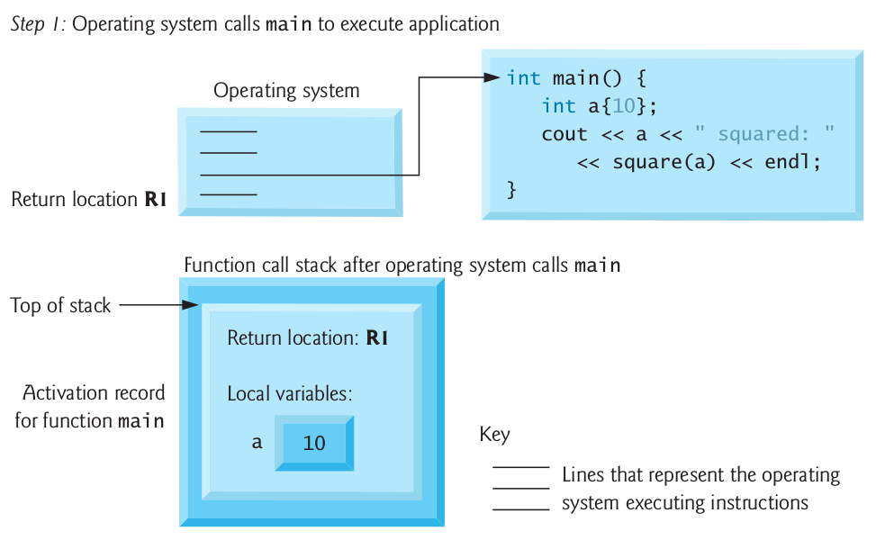
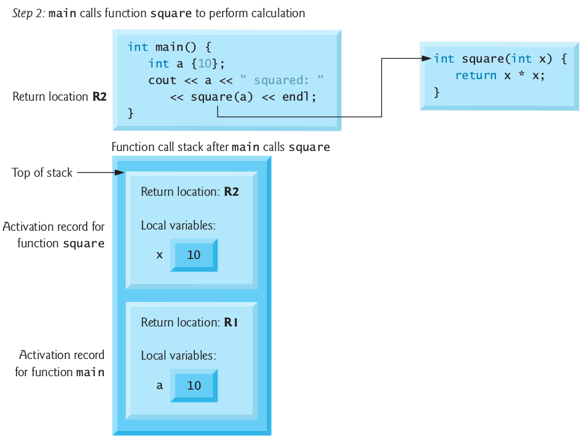
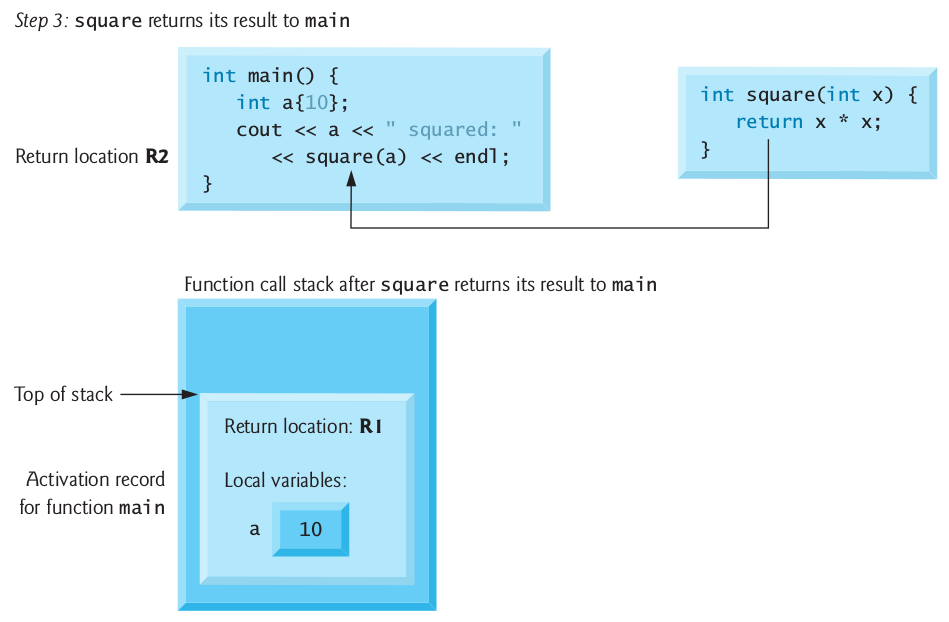

 <script src="https://cdn.mathjax.org/mathjax/latest/MathJax.js?config=TeX-AMS-MML_HTMLorMML"></script>

# Functions

Develop and maintain a large program by constructing it from small, simple pieces, or components.

    divide and conquer

Emphasize how to declare and use **functions** to facilitate the design, implementation, operation and maintenance of large programs.

- Function prototypes
- Function overloading
- Function templates
- Recursion

## General

Functions allow you to **modularize** a program by separating its tasks into self-contained units.

- To promote software reusability, every function should be limited to performing a single, well-defined task, and the name of the function should express that task effectively.

A function is invoked by a **function call**, and when the called function completes its task:
- it either **returns a result**,
- or simply **returns control** to the caller.

This hiding of implementation details promotes good software engineering.

## Global Functions

Sometimes functions are not members of a class. They are called **global functions**.

*Example:* The `<cmath>` header provides a collection of functions that enable you to perform common mathematical calculations.
- All functions in the `<cmath>` header are global functions—therefore, each is called simply by specifying the name of the function followed by parentheses containing the function's arguments.

**Problem:** Write program that returns the largest of three inputted integer numbers.

```c++
#include <iostream>
using namespace std;

int maximum(int x, int y, int z); // function prototype

int main()
{
    int a, b, c;
    cout << "Enter three integer numbers: ";
    cin >> a >> b >> c;

    cout << "Maximum number is " << maximum(a,b,c) << endl;
}

int maximum(int x, int y, int z) // function implementation
{
    int maxval = x;

    // determine if y is larger than maximum
    if (maxval < y) {
        maxval = y; // make y new maximum
    }

    // determine if z is larger than maximum
    if (maxval < z) {
        maxval = z; // make z new maximum
    }

    return maxval;
}
```

## Function Prototypes

For a function not defined in a class, you must either **define the function before using it** or you must **declare that the function exists**:
```c++
    int maximum(int x, int y, int z); // function prototype
```
This is a function prototype, which describes the maximum function without revealing its implementation.

A function prototype is a declaration of a function tells the compiler
- the function's name,
- its return type,
- and the types of its parameters.

Above prototype indicates that the function returns an `int`, has the name `maximum` and requires **three** `int` parameters to perform its task.
- The function prototype is the same as the first line of the corresponding function definition, but ends with a required semicolon.

A function prototype is required unless the function is defined before it's used.
- When you use a standard library function like `sqrt`, you do not have access to the function's definition, therefore it cannot be defined in your code before you call the function.
- Instead, you must include its corresponding header (`<cmath>`), which contains the function’s prototype.

**Always provide function prototypes**, even though it’s possible to omit them when functions are defined before they’re used. Providing the prototypes avoids tying the code to the order in which functions are defined (which can easily change as a program evolves).

Important to know:

- Parameter names in function prototypes are optional (they’re ignored by the compiler), but many programmers use these names for documentation purposes.

- Declaring function parameters of the same type as `int x, y` instead of `int x, int y` is a syntax error - a **type** is required for each parameter in the parameter list.

- Compilation errors occur if the function prototype, header and calls do not all agree in the number, type and order of arguments and parameters, and in the return type.

- A function that has many parameters may be performing too many tasks. Consider dividing the function into smaller functions that perform the separate tasks. Limit the function header to one line if possible.

- Multiple parameters are specified in both the function prototype and the function header as a comma-separated list, as are multiple arguments in a function call.

In a function that **does not return** a result (i.e., it has a void return type), we showed that control returns when the program reaches the function-ending right brace.
- You also can explicitly return control to the caller by executing the statement `return;`

## Argument Coercion

An important feature of function prototypes is **argument coercion**:
- forcing arguments to the appropriate types specified by the parameter declarations.
- these conversions occur as specified by C++'s promotion rules.

The promotion rules indicate how to convert between types without losing data.
- The promotion rules apply to expressions containing values of two or more data types.
- The type of each value in a mixed-type expression is promoted to the "highest" type in the expression.
- Converting values to lower fundamental types can result in incorrect values.
    - a value can be converted to a lower fundamental type only by explicitly assigning the value to a variable of lower type or by using a cast operator.

Lists the arithmetic data types in order from "highest type" to "lowest type."


## Random Number Generator

The function **rand** generates an unsigned integer between `0` and `RAND_MAX` (a symbolic constant defined in the `<cstdlib>` header file).

- The function prototype for the **rand** function is in `<cstdlib>`.
- The value of `RAND_MAX` must be at least 32767—the maximum positive value for a two-byte (16-bit) integer.
- For GNU C++, the value of `RAND_MAX` is 2147483647; for Visual Studio, the value of `RAND_MAX` is 32767.
- If **rand** truly produces integers at random, every number between `0` and `RAND_MAX` has an equal chance (or probability) of being chosen each time **rand** is called.

**rand** generates pseudorandom numbers:
- a sequence of numbers that appears to be random.
- sequence repeats itself each time the program executes.

Program can be conditioned to produce a different sequence of random numbers for each execution.
- This is called *randomizing* and is accomplished with the C++ Standard Library function **srand**.
- Takes an unsigned integer argument and seeds **rand** to produce a different sequence of random numbers for each execution.

To randomize without having to enter a seed use
```c++
srand(static_cast<unsigned_int>(time(0)))
```
- Causes the computer to read its clock to obtain the value for the seed.
- Function **time** (with the argument 0 as written in the preceding statement) returns the current time as the number of seconds since January 1, 1970.
- The function prototype for time is in `<ctime>`.

### Lab 1: Craps

1. Simulate a Six-Sided Die

Write a function to produce integers in the range 1 to 6 using the modulus operator (%) with `rand` function.

2. Simulate a Craps Game

Rules of Craps:
- A player rolls two dice. Each die has six faces.
- Faces contain 1, 2, 3, 4, 5 and 6 spots.
- After the dice have come to rest, the sum of the spots on the two upward faces is calculated.
    - If the sum is 7 or 11 on the first roll, the player wins.
    - If the sum is 2, 3 or 12 on the first roll (called "craps"), the player loses (i.e., the "house" wins).
    - If the sum is 4, 5, 6, 8, 9 or 10 on the first roll, then that sum becomes the player’s "point."
- To win, continue rolling until you “make your point.”
- You lose by rolling a 7 before making the point.

[Lab 1 Solution](../progs/craps.cpp)

### Lab 2: Value of Pi

Estimating the value of Pi using Monte Carlo:

The idea is to simulate random (x, y) points in a 2-D plane with domain as a square of side 1 unit. We then calculate the ratio of number points that lied inside the circle and total number of generated points:

    pi = 4*(circle_points/square_points)

1. Define a function which produces random number in interval [0,1]
2. Use this function to perform evaluation of pi value

[Lab 2 Solution](../progs/pi.cpp)

## Scope

The portion of the program where an identifier can be used is known as its **scope**.
- block scope
- global namespace scope

Identifiers declared **inside** a block have **block scope**, which begins at the identifier's declaration and ends at the terminating right brace (}) of the enclosing block.
- Local variables have block scope, as do function parameters.
- Any block can contain variable declarations.
- In nested blocks, if an identifier in an outer block has the same name as an identifier in an inner block, the one in the outer block is "hidden" until the inner block terminates.
- The inner block "sees" its own local variable’s value and not that of the enclosing block’s identically named variable.

_Note: Avoid variable names in inner scopes that hide names in outer scopes. Most compilers will warn you about this issue._

An identifier declared **outside** any function or class has **global namespace scope**.
- "known" in all functions from the point at which it’s declared until the end of the file.
- Function definitions, function prototypes placed outside a function, class definitions and global variables all have global namespace scope.
- Global variables are created by placing variable declarations outside any class or function definition. Such variables retain their values throughout a program’s execution.

_Note: Variables used only in a particular function should be declared as local variables in that function rather than as global variables._

```c++
// Scoping example.
#include <iostream>
using namespace std;

void useLocal(); // function prototype
void useStaticLocal(); // function prototype
void useGlobal(); // function prototype

int x{1}; // global variable

int main() {
   cout << "global x in main is " << x << endl;

   int x{5}; // local variable to main

   cout << "local x in main's outer scope is " << x << endl;

   { // block starts a new scope
      int x{7}; // hides both x in outer scope and global x

      cout << "local x in main's inner scope is " << x << endl;
   }

   cout << "local x in main's outer scope is " << x << endl;

   useLocal(); // useLocal has local x
   useStaticLocal(); // useStaticLocal has static local x
   useGlobal(); // useGlobal uses global x
   useLocal(); // useLocal reinitializes its local x
   useStaticLocal(); // static local x retains its prior value
   useGlobal(); // global x also retains its prior value

   cout << "\nlocal x in main is " << x << endl;
}

// useLocal reinitializes local variable x during each call
void useLocal() {
   int x{25}; // initialized each time useLocal is called

   cout << "\nlocal x is " << x << " on entering useLocal" << endl;
   ++x;
   cout << "local x is " << x << " on exiting useLocal" << endl;
}

// useStaticLocal initializes static local variable x only the
// first time the function is called; value of x is saved
// between calls to this function
void useStaticLocal() {
   static int x{50}; // initialized first time useStaticLocal is called

   cout << "\nlocal static x is " << x << " on entering useStaticLocal"
      << endl;
   ++x;
   cout << "local static x is " << x << " on exiting useStaticLocal"
      << endl;
}

// useGlobal modifies global variable x during each call
void useGlobal() {
   cout << "\nglobal x is " << x << " on entering useGlobal" << endl;
   x *= 10;
   cout << "global x is " << x << " on exiting useGlobal" << endl;
}
```

### Unary Scope Resolution Operator

- C++ provides the **unary scope resolution operator (::)** to access a global variable when a local variable of the same name is in scope.
- Using the unary scope resolution operator (::) with a given variable name is optional when the only variable with that name is a global variable.

```c++
// Unary scope resolution operator.
#include <iostream>
using namespace std;

int number{7}; // global variable named number

int main() {
   double number{10.5}; // local variable named number

   // display values of local and global variables
   cout << "Local double value of number = " << number
      << "\nGlobal int value of number = " << ::number << endl;
}
```

Tips:
- Always using the unary scope resolution operator (::) to refer to global variables (even if there is no collision with a local-variable name) makes it clear that you're intending to access a global variable rather than a local variable.
    - Always using the unary scope resolution operator (::) to refer to a global variable eliminates logic errors that might occur if a nonglobal variable hides the global variable.
- Avoid using variables of the same name for different purposes in a program. Although this is allowed in various circumstances, it can lead to errors.

## Function Call Stack

To understand how C++ performs function calls, we first need to consider a data structure (i.e., collection of related data items) known as a **stack**. It is analogous to a pile of dishes.
- When a dish is placed on the pile, it’s normally placed at the top—referred to as pushing.
- Similarly, when a dish is removed from the pile, it’s normally removed from the top—referred to as popping.

Last-in, first-out (LIFO) data structures - the last item pushed (inserted) is the first item popped (removed).

Function-Call Stack mechanism
- supports the function call/return mechanism
- supports the creation, maintenance and destruction of each called function’s automatic variables

Stack Frames
- Each function eventually must return control to the function that called it.
- Each time a function calls another function, an entry is pushed onto the function call stack.
    - This entry, called a stack frame or an activation record, contains the return address that the called function needs in order to return to the calling function.
- When a function call returns, the stack frame for the function call is popped, and control transfers to the return address in the popped stack frame.

Stack Overflow
- The amount of memory in a computer is finite, so only a certain amount of memory can be used to store activation records on the function call stack.
- If more function calls occur than can have their activation records stored on the function call stack, an a fatal error known as stack overflow occurs.

Example:

```c++
#include <iostream>
using namespace std;

int square(int); // prototype

int main() {
    int a = 10;
    cout << a << " squared: " << square(a) << endl;
}

int square(int x){ // x is a local variable
    return x*x;
}
```

First, the operating system calls `main` - this pushes an activation record onto the stack.
- The activation record tells main how to return to the operating system (i.e., transfer to return address R1) and contains the space for main’s automatic variable (i.e., a, which is initialized to 10).



Function `main` - before returning to the operating system - now calls function `square`.
- This causes a stack frame for `square` to be pushed onto the function call stack.
- This stack frame contains the return address that square needs to return to main (i.e., R2) and the memory for square’s automatic variable (i.e., x).



After square calculates the square of its argument, it needs to return to `main` - and no longer needs the memory for its automatic variable x. So `square` stack frame is popped from the stack—giving square the return location in main (i.e., R2) and losing square's automatic variable.



## References and Reference Parameters

Two ways to pass arguments to functions in many programming languages are **pass-by-value** and **pass-by-reference**.

### Pass-by-Value

When an argument is __passed by value__, a copy of the argument's value is made and passed (on the function call stack) to the called function.
- Changes to the copy do not affect the original variable’s value in the caller.
    - To specify a reference to a constant, place the `const` qualifier before the type specifier in the parameter declaration.

- One disadvantage of pass-by-value is that, if a large data item is being passed, copying that data can take a considerable amount of execution time and memory space.

### Pass-by-Reference
With __pass-by-reference__, the caller gives the called function the ability to access the caller's data directly, and to modify that data.
- A reference parameter is an alias for its corresponding argument in a function call.
- To indicate that a function parameter is passed by reference, simply follow the parameter's type in the function prototype by an ampersand (&); use the same convention when listing the parameter’s type in the function header.
- Pass-by-reference is good for performance reasons, because it can eliminate the pass-by-value overhead of copying large amounts of data.

```c++
// Passing arguments by value and by reference.
#include <iostream>
using namespace std;

int squareByValue(int); // function prototype (value pass)
void squareByReference(int&); // function prototype (reference pass)

int main() {
   int x{2}; // value to square using squareByValue
   int z{4}; // value to square using squareByReference

   // demonstrate squareByValue
   cout << "x = " << x << " before squareByValue\n";
   cout << "Value returned by squareByValue: "
      << squareByValue(x) << endl;
   cout << "x = " << x << " after squareByValue\n" << endl;

   // demonstrate squareByReference
   cout << "z = " << z << " before squareByReference" << endl;
   squareByReference(z);
   cout << "z = " << z << " after squareByReference" << endl;
}

// squareByValue multiplies number by itself, stores the
// result in number and returns the new value of number
int squareByValue(int number) {
   return number *= number; // caller's argument not modified
}

// squareByReference multiplies numberRef by itself and stores the result
// in the variable to which numberRef refers in function main
void squareByReference(int& numberRef) {
   numberRef *= numberRef; // caller's argument modified
}
```

### References

- References can also be used as aliases for other variables within a function.
- Reference variables must be initialized in their declarations and cannot be reassigned as aliases to other variables.
- Once a reference is declared as an alias for another variable, all operations supposedly performed on the alias are actually performed on the original variable.
- To specify that a reference parameter should not be allowed to modify the corresponding argument, place the `const` qualifier before the type name in the parameter's declaration.
- `string` objects can be large, so they should be passed to functions by reference.

Functions can return references, but this can be dangerous.
- When returning a reference to a variable declared in the called function, the variable should be declared static in that function.
- Returning a reference to a local variable in a called function is a **logic error** for which compilers typically issue a warning.
- Compilation warnings indicate potential problems, so most software-engineering teams have policies requiring code to compile without warnings.

## Function Overloading

- C++ enables several functions of the same name to be defined, as long as they have different signatures.
- This is called **function overloading**.
- The C++ compiler selects the proper function to call by examining the number, types and order of the arguments in the call.
- Function overloading is used to create several functions of the same name that perform similar tasks, but on different data types.

```c++
// Overloaded square functions.
#include <iostream>
using namespace std;

// function square for int values
int square(int x) {
   cout << "square of integer " << x << " is ";
   return x * x;
}

// function square for double values
double square(double y) {
   cout << "square of double " << y << " is ";
   return y * y;
}

int main() {
   cout << square(7); // calls int version
   cout << endl;
   cout << square(7.5); // calls double version
   cout << endl;
}
```

Compiler differentiates among overloaded functions.
- Overloaded functions are distinguished by their signatures.
    - A signature is a combination of a function’s name and its parameter types (in order).
- The compiler encodes each function identifier with the types of its parameters.


## Function Templates

- If the program logic and operations are identical for each data type, overloading may be performed more compactly and conveniently by using function templates.
- You write a single function template definition.
- Given the argument types provided in calls to this function, C++ automatically generates separate **function template specializations** to handle each type of call appropriately.
- All function template definitions begin with the **template** keyword followed by a **template parameter list** enclosed in angle brackets (< and >).
- Every parameter in the template parameter list is preceded by keyword typename or keyword class.
- The type parameters are placeholders for fundamental types or user-defined types.
    - Used to specify the types of the function’s parameters, to specify the function’s return type and to declare variables within the body of the function definition.

```c++
// Function template maximum header.
template <typename T>  // or template<class T>
T maximum(T value1, T value2, T value3) {
   T maximumValue{value1}; // assume value1 is maximum

   // determine whether value2 is greater than maximumValue
   if (value2 > maximumValue) {
      maximumValue = value2;
   }

   // determine whether value3 is greater than maximumValue
   if (value3 > maximumValue) {
      maximumValue = value3;
   }

   return maximumValue;
}
```


## Recursion

A **recursive function** is a function that calls itself, either directly, or indirectly (through another function).

Recursive problem-solving approaches have a number of elements in common.
- A recursive function is called to solve a problem.
- The function actually knows how to solve only the simplest case(s), or so-called base case(s).
- If the function is called with a base case, the function simply returns a result.
- If the function is called with a more complex problem, it typically divides the problem into two conceptual pieces - a piece that the function knows how to do and a piece that it does not know how to do.
- This new problem looks like the original, so the function calls a copy of itself to work on the smaller problem - this is referred to as a **recursive call** and is also called the **recursion step**.


```c++
// Recursive function factorial.
#include <iostream>
#include <iomanip>
using namespace std;

unsigned long factorial(unsigned long); // function prototype

int main() {
   // calculate the factorials of 0 through 10
   for (unsigned int counter{0}; counter <= 10; ++counter) {
      cout << setw(2) << counter << "! = " << factorial(counter)
         << endl;
   }
}

// recursive definition of function factorial
unsigned long factorial(unsigned long number) {
   if (number <= 1) { // test for base case
      return 1; // base cases: 0! = 1 and 1! = 1
   }
   else { // recursion step
      return number * factorial(number - 1);
   }
}

// iterative method factorial
unsigned long factorial(unsigned int number) {
   unsigned long result{1};

   // iterative factorial calculation
   for (unsigned int i{number}; i >= 1; --i) {
      result *= i;
   }

   return result;
}
```

- The recursion step often includes the key-word return, because its result will be combined with the portion of the problem the function knew how to solve to form the result passed back to the original caller, possibly main.
- The recursion step executes while the original call to the function is still "open", i.e., it has not yet finished executing.
- The recursion step can result in many more such recursive calls.

### Recursion vs Iteration

Both iteration and recursion are based on a control statement:
- Iteration uses an iteration statement
- Recursion uses a selection statement.

Both iteration and recursion involve iteration:
- Iteration explicitly uses an iteration statement
- Recursion achieves repetition through repeated function calls.

Iteration and recursion each involve a termination test:
- Iteration terminates when the loop-continuation condition fails
- Recursion terminates when a base case is recognized.

Counter-controlled iteration and recursion both gradually approach termination:
- Iteration modifies a counter until the counter assumes a value that makes the loop-continuation condition fail
- Recursion produces simpler versions of the original problem until the base case is reached.

Both iteration and recursion can occur infinitely:
- An infinite loop occurs with iteration if the loop-continuation test never becomes false
- Infinite recursion occurs if the recursion step does not reduce the problem during each recursive call in a manner that converges on the base case.


## Lab 3

Write program to calculate a Fibonacci number. The sequence \(F_n\) of Fibonacci numbers is defined by the recurrence relation:

$$F_n = F_{n-1} + F_{n-2}$$

[Lab 3 Solution](../progs/fib.cpp)

## Lab 4

Write a recursive function `power(base, exponent)` that, when invoked, returns `base^exponent`.

For example, power(3, 4) = 3 * 3 * 3 * 3 . Assume that exponent is an integer greater than or equal to 1.

Hint: The recursion step would use the relationship

$$base^{exponent} = base \times base^{exponent - 1}$$

and the terminating condition occurs when exponent is equal to 1 , because

$$base^1 = base$$

[Lab 4 Solution](../progs/power.cpp)


## Lab 5

The greatest common divisor (GCD) of two integers is the largest integer that evenly divides each of the numbers.
- Write a function gcd that returns the greatest common divisor of two integers.
- Write a recursive function `gcd` that returns the greatest common divisor of `x` and `y`, defined recursively as follows:

        If y is equal to 0 , then gcd(x, y) is x ;
        otherwise, gcd(x, y) is gcd(y, x % y)

        Note: For this algorithm, `x` must be larger than `y`.

[Lab 5 Solution](../progs/gcd.cpp)
