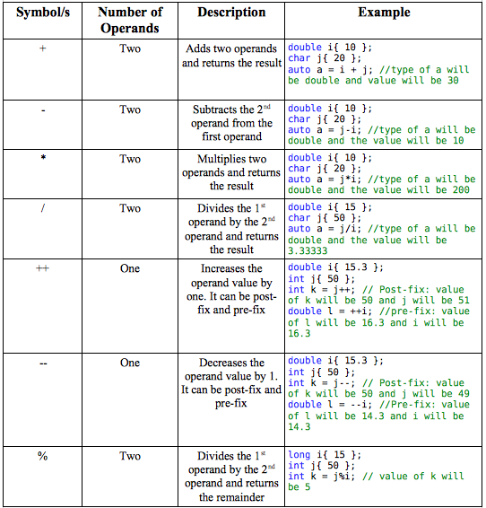
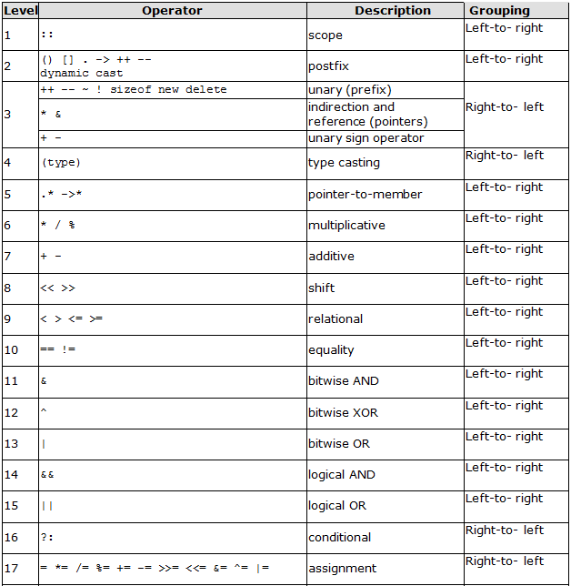
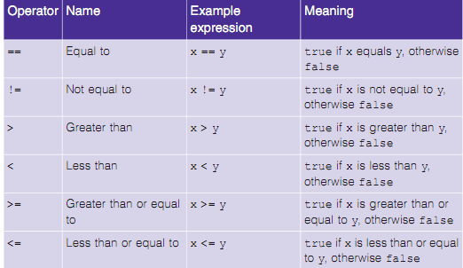

# Input/Output and Operators

## Input/Output


```c++
#include <iostream> // allows program to output data to the screen

int main() // function main begins program execution
{
    std::cout << "Welcome to C++!\n"; // display message

    return 0; // indicate that program ended successfully
    
} // end function main
```

Edit and run to above program: https://coliru.stacked-crooked.com/a/0ddabf5f1e1e0792

### Comments


- **//** indicates that the remainder of each line is a comment.

  - You insert comments to document your programs and to help other people read and understand them.
  - Comments are ignored by the C++ compiler and do not cause any machine-language object code to be generated.
  - A comment beginning with // is called a single-line comment because it terminates at the end of the current line.

- You also may use comments containing one or more lines enclosed in **/*** and ***/**.

- Every program should begin with a comment that describes the purpose of the program.

### Preprocessing

```c
#include <iostream> // allows program to output data to the screen
```

- A **preprocessing directive** is a message to the C++ preprocessor.
- Lines that begin with # are processed by the preprocessor before the program is compiled.
- _#include &lt;iostream>_ notifies the preprocessor to include in the program **the contents of the input/output stream header file &lt;iostream>**.
  - This header is a file containing information used by the compiler when compiling any program that outputs data to the screen or inputs data from the keyboard using C++-style stream input/output.


### Code

- You use blank lines, space characters and tab characters (i.e., "tabs") to make programs easier to read.
  - Together, these characters are known as white space.
  - White-space characters are normally ignored by the compiler.
- **main** is a part of every C++ program.
- The parentheses after main indicate that main is a program building block called a function.
```c
    int main()
```
- C++ programs begin executing at function main, even if main is not the first function defined in the program.

### Code (cont.)

- C++ programs typically consist of one or more functions and classes.
- Exactly one function in every program must be named **main**.
- C++ programs begin executing at function main, even if main is not the first function defined in the program.
- The keyword **int** to the left of main indicates that main “returns” an integer (whole number) value.
- A keyword is a word in code that is reserved by C++ for a specific use.
  - For now, simply include the keyword int to the left of main in each of your programs.
```c
int main()
```

### C/C++ Basic Syntax

Blocks:

- A **left brace, {**, must begin the body of every function.
- A corresponding **right brace, }**, must end each function's body.
- A statement instructs the computer to **perform an action**.
- Together, the quotation marks and the characters between them are called **a string, a character string or a string literal**.
- We refer to characters between double quotation marks simply as **strings**.
  - White-space characters in strings are not ignored by the compiler.
- Most C++ statements end with a **semicolon (;)**, also known as the **statement terminator**.
  - Preprocessing directives (like #include) do not end with a semicolon.

### Tips:

- Indent the body of each function one level within the braces that delimit the function's body. This makes a program's functional structure stand out, making the program easier to read.
- Set a convention for the size of indent you prefer, then apply it uniformly. The tab key may be used to create indents, but tab stops may vary. We prefer three spaces per level of indent.

### Namespase

- Namespaces allow us to group named entities that otherwise would have global scope into narrower scopes, giving them namespace scope. This allows organizing the elements of programs into different logical scopes referred to by names.
- E.g. **std** namespace designate collection of types and functions related to the C++ standard library.

```c++
using namespace std;
```

## Streams

- Typically, output and input in C++ are accomplished with **streams** of data. 
- When a *cout* statement executes, it sends a stream of characters to the **standard output stream object - std::cout** - which is normally "connected" to the screen.
- The *std::* before *cout* is required when we use names that we've brought into the program by the preprocessing directive #include &lt;iostream>.
  - The notation *std::cout* specifies that we are using a name, in this case c out, that belongs to "namespace" std.
  - The names *cin* (the standard input stream) and *cerr* (the standard error stream) also belong to namespace *std*.  
- In the context of an output statement, the << operator is referred to as the **stream insertion operator**.
  - The value to the operator’s right, the right operand, is inserted in the output stream.

### Escape Characters

- The characters **\n** are not printed on the screen.
- The backslash (**\**) is called an escape character.
  - It indicates that a "special" character is to be output.
- When a backslash is encountered in a string of characters, the next character is combined with the backslash to form an escape sequence.
- The escape sequence **\n** means newline.
  - Causes the cursor to move to the beginning of the next line on the screen.
  
[Escape Characters on Wikipedia](https://en.wikipedia.org/wiki/Escape_character)
  
  
**Note:** Standard library provides a dedicated end line function, **std::endl**. See https://en.cppreference.com/w/cpp/io/manip/endl


```c++
std::cout << "Welcome ";
std::cout << "to C++!" << std::endl;
```

    Welcome to C++!


```c++
std::cout << "Welcome\nto\nC++!" << std::endl;
```

    Welcome
    to
    C++!


### Exersise

Write a program that prints C++ as follows:

```
  CCC    +      +
 C       +      +
C      +++++  +++++  
 C       +      +
  CCC    +      +
```

## Adding Integers

The next program obtains two integers typed by a user at the keyboard using `std:cin`, computes their sum and outputs the result using `std::cout`.


```c++
// Calculate the product of three integers
#include <iostream> // enables program to perform input and output
using namespace std; // program uses names from the std namespace

// function main begins program execution
int main() {
    int number1 = 0; // first integer to sum
    int number2{0}; // second integer to sum
    int result{0}; // the sum of the two integers

    cout << "Enter first integer: "; // prompt user for data
    cin >> number1; // read first integer from user input
   
    cout << "Enter second integer: "; // prompt user for data
    cin >> number2; // read second integer from user input
    
    result = number1 + number2; // sum the two integers; store result
    cout << "The sum is " << result << endl; // print result; end line
} // end function main 
```

## Variables

- Declarations introduce identifiers into programs.
- The identifiers *number1*, *number2* and *result* are the names of variables.
- A variable is a location in the computer's memory where a value can be stored for use by a program.
- Variables *number1*, *number2* and *result* are data of type **int**, meaning that these variables will hold **integers** (whole numbers such as 7, -11, 0 and 31914).
- All variables **must** be declared with a name and a data type before they can be used in a program.
- If more than one name is declared in a declaration (as shown here), the names are separated by commas (,); this is referred to as a comma-separated list.

## Variables (cont.)

- A variable name is any valid **identifier** that is not a keyword.
- An **identifier** is a series of characters consisting of letters, digits and underscores ( _ ) that does not begin with a digit.
- C++ is **case sensitive**  - uppercase and lowercase letters are different, so a1 and A1 are different identifiers.
- Declarations of variables can be placed almost anywhere in a program, but they must appear before their corresponding variables are used in the program.

### Tips
- C++ allows identifiers of any length
- Choosing meaningful identifiers helps make a program **self-documenting**
- Avoid using abbreviations in identifiers. This improves program readability.
- Do not use identifiers that begin with underscores and double underscores, because C++ compilers use names like that for their own purposes internally.

## Assignment

- In this program, an assignment statement adds the values of variables number1 and number2 and assigns the result to variable sum using **the assignment operator =**.
  - Most calculations are performed in assignment statements.
- The = operator and the + operator are called **binary** operators because each has two operands.

**Tips**

- Place spaces on either side of a binary operator. This makes the operator stand out and makes the program more readable.

## Arithmetic

Arithmetic expressions in C++ must be entered into the computer in straight-line form.



## Precedence

C++ applies the operators in arithmetic expressions in a precise sequence determined by the following rules of operator precedence, which are generally the same as those followed in algebra.



### Exersise

Write a program that calculates the surface area and volume of cubes with face lengths of 0 to 4 cm. Use tabs to print the following neatly formatted table of values:

```
Side length   Surface area    Volume
of cube (cm)  of cube (cm^2)  of cube (cm^3)
1             1               1
2             4               8
3             9               27 
4             16              64
```

## Data Types

- **Primitive Data Types**: Built-in or predefined data types and can be used directly by the user to declare variables. example: int, char , float, bool etc. Primitive data types available in C++ are:

  - int - Integer
  - char - Character
  - bool - Boolean
  - float - Floating Point
  - double - Double Floating Point
  - void - Valueless or Void

- **Abstract or user defined data type**: These data types are defined by user itself. Like, defining a class in C++ or a structure.


```c++
#include<iostream>
using namespace std;

cout << "Size of char : " << sizeof(char) << " byte" << endl;
cout << "Size of int : " << sizeof(int) << " bytes" << endl;
cout << "Size of float : " << sizeof(float) << " bytes" <<endl;
cout << "Size of double : " << sizeof(double) << " bytes" << endl;
cout << "Size of wchar_t : " << sizeof(wchar_t) << " bytes" <<endl;
```

    Size of char : 1 byte
    Size of int : 4 bytes
    Size of float : 4 bytes
    Size of double : 8 bytes
    Size of wchar_t : 4 bytes


## Data Modifiers

- **Datatype Modifiers** are used with the built-in data types to modify the length of data that a particular data type can hold.

  - signed
  - unsigned
  - short
  - long


```c++
#include<iostream>
using namespace std;

cout << "Size of int : " << sizeof(int) << " bytes" << endl;
cout << "Size of short int : " << sizeof(short int) << " bytes" << endl;
cout << "Size of long int : " << sizeof(long int) << " bytes" << endl;
cout << "Size of signed long int : " << sizeof(signed long int) << " bytes" << endl;
cout << "Size of unsigned long int : " << sizeof(unsigned long int) << " bytes" << endl;
```

    Size of int : 4 bytes
    Size of short int : 2 bytes
    Size of long int : 8 bytes
    Size of signed long int : 8 bytes
    Size of unsigned long int : 8 bytes


## Advanced Stream Usage

A stream is an abstraction for input/output. You can think of it as a source (input) or destination (output) of characters of indefinite length. 


### Stream Manipulators

`setw(n)` sets the minimum width of the input for the next stream operation. If the data doesn't meet the minimum field requirement, it is padded with the default fill character until it is proper size.


```c++
#include <iostream> // for setw()

std::cout << "Output: " << 10 << std::endl;
```

    Output: 10


```c++
std::cout << "Output: " << std::setw(5) << 10 << std::endl;
```

    Output:    10


`setprecision(n)` sets the precision of the stream **out** or **in** to exactly **n**. 


```c++
#include <iostream>
#include <cmath> // for pow() 
#include <iomanip> // for setprecision()

std::cout << "1 petabyte is 2^50 bytes = "
          << std::setprecision(20) 
          << pow(2., 50) << " bytes" 
          << std::endl;
```

    1 petabyte is 2^50 bytes = 1125899906842624 bytes


`boolalpha` determines whether or not the stream should output boolean values as 1 and 0 or as "true" and "false". The opposite manipulator is noboolalpha, which reverses this behaviour.


```c++
std::cout << true << std::endl;
```

    1


```c++
std::cout << std::boolalpha<< true << std::endl;
```

    true


`oct`, `dec`, `hex` set the radix on the stream to either octal (base 8), decimal (base 10), or hexadecimal (base 16). This can be used either to format output or change the base for input.


```c++
std::cout << 10 << std::endl;
```

    10


```c++
std::cout << std::dec << 10 << std::endl;
```

    10


```c++
std::cout << std::oct << 10 << std::endl;
```

    12


```c++
std::cout << std::hex << 10 << std::endl;
```

    a


More example of stream library use in here: https://andersy005.github.io/blog/2018/01/20/play-interactively-with-cpp-streams/

## Conditional Statement

The **if statement (conditional statement)** allows a program to take alternative action based on whether a condition is **true or false**.
- If the condition is true, the statement in the body of the if statement is executed.
- If the condition is false, the body statement is not executed.

```c
if (logical-condition)
{
// statements are executed if the condition is true
}
else
{
// statements are executed if the condition is false
}
```

## Conditional Statement (cont.)

Conditions in *if* statements can be formed by using the equality operators and relational operators.
- The relational operators all have the same level of precedence and associate left to right.
- The equality operators both have the same level of precedence, which is lower than that of the relational operators, and associate left to right.

*else* part of the conditional statement is optional, so the following code is valid.
```c
if (logical-condition)
{
// statements are executed if the condition is true
}
```

*Tips: Indent the statement(s) in the body of an if statement to enhance readability.*

## Equality and Relational Operators



## Comparing integers


```c++
// Comparing integers using if statements, relational operators
// and equality operators.
#include <iostream> // enables program to perform input and output

using std::cout; // program uses cout
using std::cin; // program uses cin
using std::endl; // program uses endl

// function main begins program execution
int main() {
   int number1{0}; // first integer to compare (initialized to 0)
   int number2{0}; // second integer to compare (initialized to 0)
   
   cout << "Enter two integers to compare: "; // prompt user for data
   cin >> number1 >> number2; // read two integers from user

   if (number1 == number2) {
      cout << number1 << " == " << number2 << endl;
   }

   if (number1 != number2) {
      cout << number1 << " != " << number2 << endl;
   }

   if (number1 < number2) {
      cout << number1 << " < " << number2 << endl;
   }

   if (number1 > number2) {
      cout << number1 << " > " << number2 << endl;
   }

   if (number1 <= number2) {
      cout << number1 << " <= " << number2 << endl;
   }

   if (number1 >= number2) {
      cout << number1 << " >= " << number2 << endl;
   }
} // end function main
```

### Exersise

Write a program that asks for the number of calories and fat grams in a food.

- The program should display the percentage of calories that come from fat.
- If the calories from fat are less than 30% of the total calories of the food, it should also display a message indicating that the food is low in fat.
- One gram of fat has 9 calories, so Calories_from_fat = fat_grams * 9
- Your program should display instructions to the user, and should check that inputs make sense, exiting with an informative error message if not.
