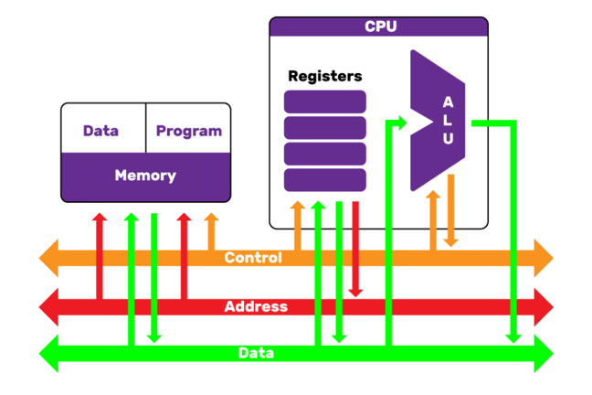
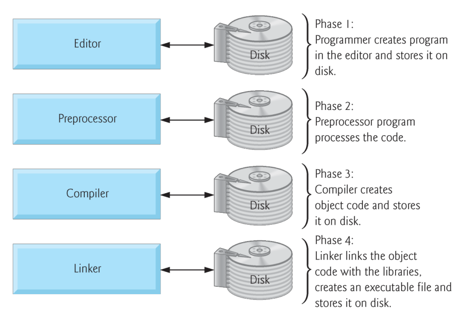
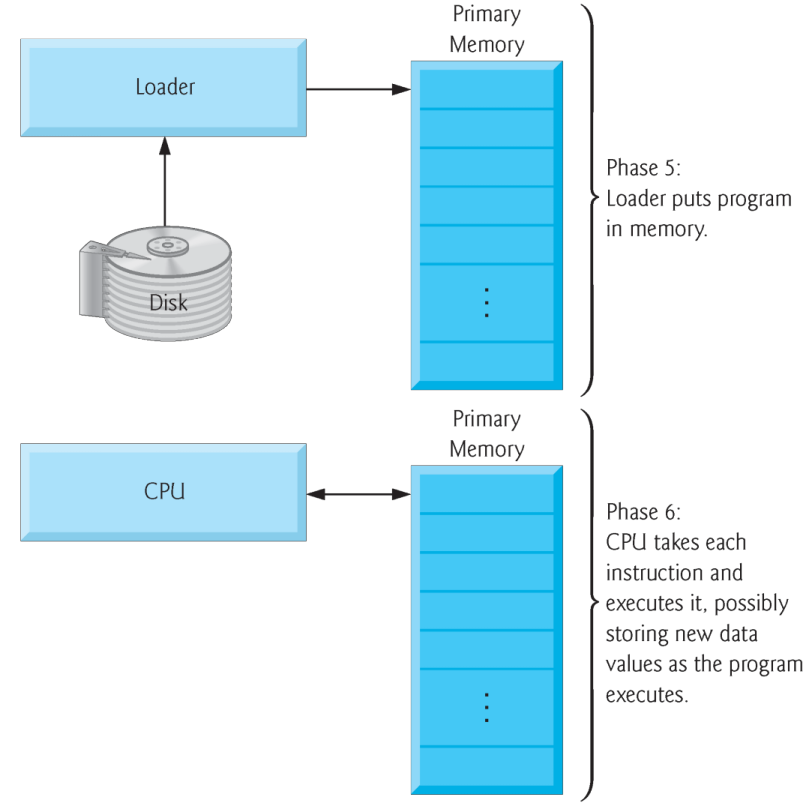

# Introduction to Computers & C++ Programming

## Computer Architecture Influence
<div style="width:40%; float: right">
    
</div>

- Well-known computer architecture: Von Neumann
- Data and programs stored in memory
- Memory is separate from CPU
- Instructions and data are piped from memory to CPU

## Hardware and Software

**Software** (i.e., the instructions you write) controls **hardware** (i.e., computers).

Regardless of differences in physical appearance, computers can be envisioned as divided into various logical units or sections:

- **Memory unit:** This rapid-access section retains information that has been entered through the input unit, also retains processed information until it can be placed on output devices by the output unit.

- **Arithmetic and logic unit (ALU):** This unit performs calculations, and also contains the decision mechanisms. The ALU is implemented as part of the next logical unit, the CPU.

- **Central processing unit (CPU):** The CPU tells the input unit when information should be read into the memory unit, tells the ALU when information from the memory unit should be used in calculations and tells the output unit when to send information from the memory unit to certain output devices.

## Hardware and Software (cont.)

- **Input unit:** This “receiving” section obtains information (data and computer programs) from input devices and places it at the disposal of the other units for processing.

- **Output unit:** This “shipping” section takes information the computer has processed and places it on various output devices to make it available for use outside the computer. 

## Byte measurements
<style type="text/css">
  .text_cell.rendered td .rendered_html td {
    max-width: none;
    white-space: normal;
    line-height: normal;
    padding: 0.3em 0.5em;
    font-size: 15px;
  }
</style>
|Unit            |Bytes          | Exactly | Which is approximately |
|----------------|---------------|---------|---------------|
|1 kilobyte (KB) |1024 bytes     | $2^{10}$  | $10^3$ (1024) bytes exactly |
|1 megabyte (MB) |1024 kilobytes | $2^{20}$  | $10^6$ (1,000,000) bytes |
|1 gigabyte (GB) |1024 megabytes | $2^{30}$  | $10^9$ (1,000,000,000) bytes
|1 terabyte (TB) |1024 gigabytes | $2^{40}$  | $10^{12}$ (1,000,000,000,000) bytes
|1 petabyte (PB) |1024 terabytes | $2^{50}$  | $10^{15}$ (1,000,000,000,000,000) bytes
|1 exabyte (EB)  |1024 petabytes | $2^{60}$  | $10^{18}$ (1,000,000,000,000,000,000) bytes
|1 zettabyte (ZB)|1024 exabytes  | $2^{70}$  | $10^{21}$ (1,000,000,000,000,000,000,000) bytes


```c++
#include <iostream>
#include <iomanip>
#include <cmath>

std::cout << "1 petabyte is 2^50 bytes = " << std::setprecision(20) <<  pow(2., 50) << " bytes" << std::endl;
```

    1 petabyte is 2^50 bytes = 1125899906842624 bytes


Edit and run to above program: https://coliru.stacked-crooked.com/a/d856d69604863045

## Programming Languages

- **Machine languages** (also called machine code), defined by the hardware architecture, binary, not portable.
- **Assembly languages** instead of binary code, English-like abbreviations used to represent elementary operations, not portable.
```asm
LOAD A, 9999
LOAD B, 8282
SUB B
MOV C, A
```

## Programming Languages (cont.)

- **High-level languages** use instructions that look almost like everyday English and contain commonly used mathematical notations, processor independent & portable.
  - Compiling a high-level language program into machine language can take a considerable amount of computer time.
  - Interpreter programs were developed to execute high-level language programs directly (without the need for compilation), although more slowly than compiled programs.

### Example of Prgramming Language

- C, 1972, Dennis Ritchie (Imperative procedural)

```c
#include<stdio.h>

int main()
{
  printf("\nHello world!");
  return 0;
}
```

- C++, 1985, Bjarne Stroustrup (Imperative object-oriented)

```c++
#include <iostream>

int main () {
  std::cout << "Hello world!" << std::endl;
}
```

### Example of Prgramming Language

- Python, 1990, Guido van Rossum (Imperative object-oriented & functional)

```python
import sys
sys.stdout.write("Hello world!\n")
```
- Java, 1995, James Gosling (Imperative object-oriented)

```java
public class HelloWorld
{
  public static void main(String[] args)
  {
    System.out.println("Hello world!");
  }
}
```

### C

C systems generally consist of several parts: 

- a program development environment
- the language
- the C Standard Library.




### C (cont.)

C programs typically go through six phases to be executed: 

- edit: using editor program or IDE (integrated development environment)
  - C program file names should end with the .c extension.
- preprocess
  - the C preprocessor obeys special commands called preprocessor directives, which indicate that certain manipulations are to be performed on the program before compilation.
- compile
  - the C compiler translates the C program into machine-language code.



### C (cont.)

C programs typically go through six phases to be executed: 

- link
  - C programs typically contain references to functions defined elsewhere (e.g. the standard libraries).
  - A **linker** links the object code with the code for the missing functions to produce an executable image.
- load
  - The program must first be placed in memory before it can be executed
  - The loader takes the executable image from disk and transfers it to memory.
- execute
  - The computer, under the control of its CPU, executes the program one instruction at a time.

### C++

- C++ - a powerful computer programming language that’s appropriate for technically oriented people with little or no programming experience, and for experienced programmers to use in building substantial information systems.

- C++ is one of today’s most popular software development languages.

- C++11 and C++14 are the latest versions standardized through the International Organization for Standardization (ISO) and the International Electrotechnical Commission (IEC).

- C++ Standard Library
  - C++ programs consist of pieces called classes and functions.
  - Most C++ programmers take advantage of the rich collections of classes and functions in the C++ Standard Library.

## Software Engineering

- **Software reuse:** Use existing pieces wherever possible. This practice is central to effective object-oriented programming.
  - Avoid reinventing the wheel.
  
- When programming in C++ use the following building blocks:
  - classes and functions from the C++ Standard Library
  - classes and functions you and your colleagues create
  - classes and functions from various popular third-party libraries.
  
- Using C++ Standard Library functions and classes instead of writing your own versions can improve program performance, because they are written carefully to perform efficiently.
  - This technique also shortens program development time.
  - They are included in every C++ implementation.


```c++
#include <iostream> // allows program to output data to the screen

int main() // function main begins program execution
{
   std::cout << "Welcome to C++!\n"; // display message

   return 0; // indicate that program ended successfully

} // end function main
```

    Welcome to C++!


    @0x7fc0b078bee0


Edit and run to above program: https://coliru.stacked-crooked.com/a/0ddabf5f1e1e0792
