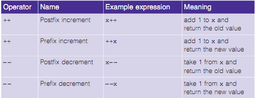
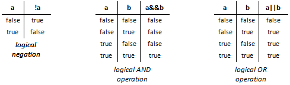

# Operators

## Compound Assignment Operators

The **compound assignment operators** abbreviate assignment expressions.

The `+=` operator adds the value of the expression on the right of the operator to the value of the variable on the left of the operator and stores the result in the variable on the left of the operator.

Any statement of the form

    variable = variable operator expression;

in which **the same variable appears on both sides of the assignment operator and operator is one of the binary operators:

    + - * / % & |

can be written in the form

    variable operator= expression;

Thus the assignment `c += 3` adds 3 to variable `c`.

```c++
#include <iostream>
using namespace std;

main() {
   int a = 21;
   int c ;

   c =  a;
   cout << "Line 1 - =  Operator, Value of c = : " <<c<< endl ;

   c +=  a;
   cout << "Line 2 - += Operator, Value of c = : " <<c<< endl ;

   c -=  a;
   cout << "Line 3 - -= Operator, Value of c = : " <<c<< endl ;

   c *=  a;
   cout << "Line 4 - *= Operator, Value of c = : " <<c<< endl ;

   c /=  a;
   cout << "Line 5 - /= Operator, Value of c = : " <<c<< endl ;

   c  = 200;
   c %=  a;
   cout << "Line 6 - %= Operator, Value of c = : " <<c<< endl ;

   c <<=  2;
   cout << "Line 7 - <<= Operator, Value of c = : " <<c<< endl ;

   c >>=  2;
   cout << "Line 8 - >>= Operator, Value of c = : " <<c<< endl ;

   c &=  2;
   cout << "Line 9 - &= Operator, Value of c = : " <<c<< endl ;

   c ^=  2;
   cout << "Line 10 - ^= Operator, Value of c = : " <<c<< endl ;

   c |=  2;
   cout << "Line 11 - |= Operator, Value of c = : " <<c<< endl ;

   return 0;
}
```

[Run this example](http://tpcg.io/izo0rn)

## Increment/Decrement

C++ also provides two unary operators for adding 1 to or subtracting 1 from the value of a numeric variable.

- These are the unary increment operator, `++`.
- These are the unary decrement operator, `--`.

Like all other C++ operators, `++`(`--`) returns a value:

- If `++` precedes the variable, e.g. `++counter`, the value returned is the value in counter __after__ it has been incremented.
- If `++` follows the variable, e.g. `counter++`, the value returned is the value in counter __before__ it has been incremented.

_Fun fact: This allows some C++ pedants to say that C++ is wrong, as it implies the enhanced value isn't used, and that it should be called ++C._



```c++
#include <iostream>
using namespace std;

main() {
   int a = 21;
   int c ;

   // Value of a will not be increased before assignment.
   c = a++;
   cout << "Line 1 - Value of a++ is :" << c << endl ;

   // After expression value of a is increased
   cout << "Line 2 - Value of a is :" << a << endl ;

   // Value of a will be increased before assignment.
   c = ++a;
   cout << "Line 3 - Value of ++a is  :" << c << endl ;
   return 0;
}
```

[Run this example](http://tpcg.io/LM8eIY)

**Note:** Attempting to use the increment or decrement operator on an expression other than one to which a value can be assigned is a syntax error. For example, writing

```c++
++(x+1) // a syntax error, because (x + 1) is not a variable.
```

## Logical Operators

C++ provides **logical operators** that are used to form more complex conditions by combining simple conditions.

- The logical operators are `&&` (logical AND), `||` (logical OR) and `!` (logical NOT, also called logical negation).

The `&&` (logical AND) operator is used to ensure that two conditions are both true before we choose a certain path of execution.
- The simple condition to the left of the && operator evaluates first.
- If necessary, the simple condition to the right of the && operator evaluates next.
- The right side of a logical AND expression is evaluated only if the left side is true.

The `||` (logical OR) operator determines if either or both of two conditions are true before we choose a certain path of execution.
- The && operator has a higher precedence than the || operator.
- Both operators associate from left to right.

The `!` (logical negation, also called logical NOT or logical complement) operator "reverses" the meaning of a condition.
- Unlike the logical operators `&&` and `||`, which are binary operators that combine two conditions, the logical negation operator is a unary operator that has only one condition as an operand.

### Truth table for the logical operators


```c++
// Logical operators.
#include <iostream>
using namespace std;
int main() {
    // create truth table for && (logical AND) operator
    cout << boolalpha << "Logical AND (&&)"
        << "\nfalse && false: " << (false && false)
        << "\nfalse && true: " << (false && true)
        << "\ntrue && false: " << (true && false)
        << "\ntrue && true: " << (true && true) << "\n\n";

    // create truth table for || (logical OR) operator
    cout << "Logical OR (||)"
        << "\nfalse || false: " << (false || false)
        << "\nfalse || true: " << (false || true)
        << "\ntrue || false: " << (true || false)
        << "\ntrue || true: " << (true || true) << "\n\n";

    // create truth table for ! (logical negation) operator
    cout << "Logical negation (!)"
        << "\n!false: " << (!false)
        << "\n!true: " << (!true) << endl;
}
```

## Lab 1

**Pythagorean Triples:** A right triangle can have sides whose lengths are all integers. The set of three integer values for the lengths of the sides of a right triangle is called a Pythagorean triple. The lengths of the three sides must satisfy the relationship that
 - the sum of the squares of two of the sides is equal to the square of the hypotenuse.

Write an application that displays a table of the Pythagorean triples for `side1`, `side2` and the `hypotenuse`, all no larger than 500.

**Hint:** Use a triple-nested `for` loop that tries all possibilities.

*Note: This is an example of "brute-force" computing. You'll learn in more advanced computer-science courses that for many interesting problems there's no known algorithmic approach other than using sheer brute force.*
